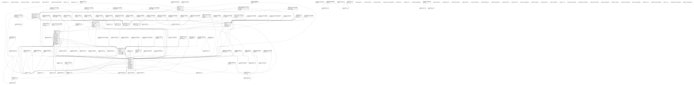

# saopche-bknd-service

## Description

Production Sapoche

## Tables

| Name                                                                                      | Columns | Comment | Type       |
| ----------------------------------------------------------------------------------------- | ------- | ------- | ---------- |
| [public.migrations](public.migrations.md)                                                 | 3       |         | BASE TABLE |
| [public.oauth_auth_codes](public.oauth_auth_codes.md)                                     | 6       |         | BASE TABLE |
| [public.oauth_access_tokens](public.oauth_access_tokens.md)                               | 9       |         | BASE TABLE |
| [public.oauth_refresh_tokens](public.oauth_refresh_tokens.md)                             | 4       |         | BASE TABLE |
| [public.oauth_clients](public.oauth_clients.md)                                           | 11      |         | BASE TABLE |
| [public.oauth_personal_access_clients](public.oauth_personal_access_clients.md)           | 4       |         | BASE TABLE |
| [public.jobs](public.jobs.md)                                                             | 7       |         | BASE TABLE |
| [public.failed_jobs](public.failed_jobs.md)                                               | 6       |         | BASE TABLE |
| [public.organizations](public.organizations.md)                                           | 4       |         | BASE TABLE |
| [public.branches](public.branches.md)                                                     | 5       |         | BASE TABLE |
| [public.users](public.users.md)                                                           | 38      |         | BASE TABLE |
| [public.sexes](public.sexes.md)                                                           | 3       |         | BASE TABLE |
| [public.user_statuses](public.user_statuses.md)                                           | 2       |         | BASE TABLE |
| [public.permissions](public.permissions.md)                                               | 5       |         | BASE TABLE |
| [public.roles](public.roles.md)                                                           | 5       |         | BASE TABLE |
| [public.model_has_permissions](public.model_has_permissions.md)                           | 3       |         | BASE TABLE |
| [public.model_has_roles](public.model_has_roles.md)                                       | 3       |         | BASE TABLE |
| [public.role_has_permissions](public.role_has_permissions.md)                             | 2       |         | BASE TABLE |
| [public.password_resets](public.password_resets.md)                                       | 5       |         | BASE TABLE |
| [public.nationalities](public.nationalities.md)                                           | 3       |         | BASE TABLE |
| [public.countries](public.countries.md)                                                   | 3       |         | BASE TABLE |
| [public.states](public.states.md)                                                         | 4       |         | BASE TABLE |
| [public.cities](public.cities.md)                                                         | 3       |         | BASE TABLE |
| [public.document_types](public.document_types.md)                                         | 3       |         | BASE TABLE |
| [public.files](public.files.md)                                                           | 4       |         | BASE TABLE |
| [public.positions](public.positions.md)                                                   | 3       |         | BASE TABLE |
| [public.branch_position](public.branch_position.md)                                       | 3       |         | BASE TABLE |
| [public.specialities](public.specialities.md)                                             | 3       |         | BASE TABLE |
| [public.speciality_user](public.speciality_user.md)                                       | 3       |         | BASE TABLE |
| [public.branch_speciality](public.branch_speciality.md)                                   | 3       |         | BASE TABLE |
| [public.contract_types](public.contract_types.md)                                         | 3       |         | BASE TABLE |
| [public.branch_contract_type](public.branch_contract_type.md)                             | 3       |         | BASE TABLE |
| [public.phone_numbers](public.phone_numbers.md)                                           | 4       |         | BASE TABLE |
| [public.banks](public.banks.md)                                                           | 8       |         | BASE TABLE |
| [public.contracts](public.contracts.md)                                                   | 7       |         | BASE TABLE |
| [public.certifications](public.certifications.md)                                         | 8       |         | BASE TABLE |
| [public.imaging_licenses](public.imaging_licenses.md)                                     | 7       |         | BASE TABLE |
| [public.doctor_licenses](public.doctor_licenses.md)                                       | 7       |         | BASE TABLE |
| [public.companies](public.companies.md)                                                   | 22      |         | BASE TABLE |
| [public.departments](public.departments.md)                                               | 6       |         | BASE TABLE |
| [public.frequencies](public.frequencies.md)                                               | 3       |         | BASE TABLE |
| [public.service_groups](public.service_groups.md)                                         | 53      |         | BASE TABLE |
| [public.services](public.services.md)                                                     | 56      |         | BASE TABLE |
| [public.department_service](public.department_service.md)                                 | 5       |         | BASE TABLE |
| [public.service_service_group](public.service_service_group.md)                           | 4       |         | BASE TABLE |
| [public.employees](public.employees.md)                                                   | 5       |         | BASE TABLE |
| [public.patients](public.patients.md)                                                     | 34      |         | BASE TABLE |
| [public.forms](public.forms.md)                                                           | 4       |         | BASE TABLE |
| [public.form_service](public.form_service.md)                                             | 3       |         | BASE TABLE |
| [public.form_speciality](public.form_speciality.md)                                       | 3       |         | BASE TABLE |
| [public.checkups](public.checkups.md)                                                     | 26      |         | BASE TABLE |
| [public.checkup_service](public.checkup_service.md)                                       | 7       |         | BASE TABLE |
| [public.reports](public.reports.md)                                                       | 10      |         | BASE TABLE |
| [public.file_report](public.file_report.md)                                               | 4       |         | BASE TABLE |
| [public.documents](public.documents.md)                                                   | 8       |         | BASE TABLE |
| [public.contacts](public.contacts.md)                                                     | 8       |         | BASE TABLE |
| [public.role_role](public.role_role.md)                                                   | 3       |         | BASE TABLE |
| [public.signoffs](public.signoffs.md)                                                     | 12      |         | BASE TABLE |
| [public.translations](public.translations.md)                                             | 7       |         | BASE TABLE |
| [public.company_lots](public.company_lots.md)                                             | 7       |         | BASE TABLE |
| [public.access_tokens](public.access_tokens.md)                                           | 6       |         | BASE TABLE |
| [public.examination_refuse_wavers](public.examination_refuse_wavers.md)                   | 6       |         | BASE TABLE |
| [public.recent_searches](public.recent_searches.md)                                       | 6       |         | BASE TABLE |
| [public.copper_companies](public.copper_companies.md)                                     | 7       |         | BASE TABLE |
| [public.copper_users](public.copper_users.md)                                             | 17      |         | BASE TABLE |
| [public.company_user](public.company_user.md)                                             | 5       |         | BASE TABLE |
| [public.support_tickets](public.support_tickets.md)                                       | 10      |         | BASE TABLE |
| [public.external_user_registration_tickets](public.external_user_registration_tickets.md) | 9       |         | BASE TABLE |
| [public.company_patients](public.company_patients.md)                                     | 20      |         | BASE TABLE |
| [public.company_patient_visits](public.company_patient_visits.md)                         | 9       |         | BASE TABLE |
| [public.profile_statuses](public.profile_statuses.md)                                     | 2       |         | BASE TABLE |
| [public.attune_departments](public.attune_departments.md)                                 | 7       |         | BASE TABLE |
| [public.service_group_service_group](public.service_group_service_group.md)               | 3       |         | BASE TABLE |
| [public.checkup_service_group](public.checkup_service_group.md)                           | 3       |         | BASE TABLE |
| [public.change_requests](public.change_requests.md)                                       | 8       |         | BASE TABLE |
| [public.test_sets](public.test_sets.md)                                                   | 8       |         | BASE TABLE |
| [public.service_test_set](public.service_test_set.md)                                     | 5       |         | BASE TABLE |
| [public.service_group_test_set](public.service_group_test_set.md)                         | 5       |         | BASE TABLE |
| [public.audits](public.audits.md)                                                         | 14      |         | BASE TABLE |
| [public.company_orders](public.company_orders.md)                                         | 18      |         | BASE TABLE |
| [public.company_order_service](public.company_order_service.md)                           | 5       |         | BASE TABLE |
| [public.company_order_service_group](public.company_order_service_group.md)               | 5       |         | BASE TABLE |
| [public.packages](public.packages.md)                                                     | 27      |         | BASE TABLE |
| [public.package_service](public.package_service.md)                                       | 3       |         | BASE TABLE |
| [public.package_service_group](public.package_service_group.md)                           | 3       |         | BASE TABLE |
| [public.marital_statuses](public.marital_statuses.md)                                     | 3       |         | BASE TABLE |
| [public.salutations](public.salutations.md)                                               | 3       |         | BASE TABLE |
| [public.document_ofs](public.document_ofs.md)                                             | 3       |         | BASE TABLE |
| [public.checkup_package](public.checkup_package.md)                                       | 3       |         | BASE TABLE |
| [public.company_order_test_set](public.company_order_test_set.md)                         | 5       |         | BASE TABLE |
| [public.consent_forms](public.consent_forms.md)                                           | 6       |         | BASE TABLE |
| [public.events](public.events.md)                                                         | 6       |         | BASE TABLE |
| [public.checkup_consent_form](public.checkup_consent_form.md)                             | 8       |         | BASE TABLE |
| [public.checkup_history_records](public.checkup_history_records.md)                       | 6       |         | BASE TABLE |
| [public.consent_form_mappings](public.consent_form_mappings.md)                           | 6       |         | BASE TABLE |
| [public.home_kits](public.home_kits.md)                                                   | 12      |         | BASE TABLE |
| [public.sapoche_audits](public.sapoche_audits.md)                                         | 7       |         | BASE TABLE |
| [public.devices](public.devices.md)                                                       | 6       |         | BASE TABLE |
| [public.notifications](public.notifications.md)                                           | 8       |         | BASE TABLE |
| [public.notification_settings](public.notification_settings.md)                           | 3       |         | BASE TABLE |
| [public.notification_setting_user](public.notification_setting_user.md)                   | 6       |         | BASE TABLE |
| [public.imaging_diagnostic_data](public.imaging_diagnostic_data.md)                       | 14      |         | BASE TABLE |
| [public.imaging_diagnostic_data_histories](public.imaging_diagnostic_data_histories.md)   | 16      |         | BASE TABLE |
| [public.external_credentials](public.external_credentials.md)                             | 7       |         | BASE TABLE |
| [public.job_batches](public.job_batches.md)                                               | 10      |         | BASE TABLE |
| [public.etl_jobs](public.etl_jobs.md)                                                     | 11      |         | BASE TABLE |
| [public.company_order_package](public.company_order_package.md)                           | 5       |         | BASE TABLE |
| [public.checkup_revenues](public.checkup_revenues.md)                                     | 8       |         | BASE TABLE |
| [public.app_configurations](public.app_configurations.md)                                 | 16      |         | BASE TABLE |
| [public.copper_configurations](public.copper_configurations.md)                           | 5       |         | BASE TABLE |
| [public.test_kits](public.test_kits.md)                                                   | 10      |         | BASE TABLE |
| [public.booking_codes](public.booking_codes.md)                                           | 5       |         | BASE TABLE |
| [public.test_kit_home_kit](public.test_kit_home_kit.md)                                   | 3       |         | BASE TABLE |
| [public.kit_orders](public.kit_orders.md)                                                 | 21      |         | BASE TABLE |
| [public.wards](public.wards.md)                                                           | 3       |         | BASE TABLE |
| [public.package_test_set](public.package_test_set.md)                                     | 5       |         | BASE TABLE |
| [public.checkup_surveys](public.checkup_surveys.md)                                       | 7       |         | BASE TABLE |
| [public.checkup_survey_archives](public.checkup_survey_archives.md)                       | 5       |         | BASE TABLE |
| [public.event_tracking_imports](public.event_tracking_imports.md)                         | 5       |         | BASE TABLE |
| [public.event_trackings](public.event_trackings.md)                                       | 6       |         | BASE TABLE |
| [public.company_banking_info](public.company_banking_info.md)                             | 8       |         | BASE TABLE |
| [public.refdoc_banks](public.refdoc_banks.md)                                             | 15      |         | BASE TABLE |
| [public.company_banking_info_requests](public.company_banking_info_requests.md)           | 9       |         | BASE TABLE |
| [public.company_payment_transactions](public.company_payment_transactions.md)             | 8       |         | BASE TABLE |
| [public.test_ref_ranges](public.test_ref_ranges.md)                                       | 23      |         | BASE TABLE |
| [public.categories](public.categories.md)                                                 | 5       |         | BASE TABLE |
| [public.category_service](public.category_service.md)                                     | 5       |         | BASE TABLE |
| [public.category_service_group](public.category_service_group.md)                         | 5       |         | BASE TABLE |
| [public.category_package](public.category_package.md)                                     | 5       |         | BASE TABLE |
| [public.psc_branches](public.psc_branches.md)                                             | 14      |         | BASE TABLE |
| [public.faqs](public.faqs.md)                                                             | 8       |         | BASE TABLE |
| [public.campaigns](public.campaigns.md)                                                   | 9       |         | BASE TABLE |
| [public.rewards](public.rewards.md)                                                       | 9       |         | BASE TABLE |
| [public.campaign_company](public.campaign_company.md)                                     | 7       |         | BASE TABLE |
| [public.checkup_audit_histories](public.checkup_audit_histories.md)                       | 11      |         | BASE TABLE |
| [public.examination_audit_histories](public.examination_audit_histories.md)               | 8       |         | BASE TABLE |
| [public.simple_categories](public.simple_categories.md)                                   | 6       |         | BASE TABLE |
| [public.checkup_doctor_notes](public.checkup_doctor_notes.md)                             | 8       |         | BASE TABLE |
| [public.international_vendors](public.international_vendors.md)                           | 5       |         | BASE TABLE |
| [public.doctor_surveys](public.doctor_surveys.md)                                         | 8       |         | BASE TABLE |
| [public.doctor_survey_archives](public.doctor_survey_archives.md)                         | 7       |         | BASE TABLE |
| [public.lab_test_update_schedule](public.lab_test_update_schedule.md)                     | 8       |         | BASE TABLE |
| [public.lab_test_update_schedule_archives](public.lab_test_update_schedule_archives.md)   | 7       |         | BASE TABLE |
| [public.text_value_translation](public.text_value_translation.md)                         | 6       |         | BASE TABLE |
| [public.icd_10s](public.icd_10s.md)                                                       | 6       |         | BASE TABLE |
| [public.checkup_indicator_bookings](public.checkup_indicator_bookings.md)                 | 6       |         | BASE TABLE |
| [public.prescription_histories](public.prescription_histories.md)                         | 9       |         | BASE TABLE |
| [public.prescription_doctors](public.prescription_doctors.md)                             | 5       |         | BASE TABLE |
| [public.indicator_signature_allocations](public.indicator_signature_allocations.md)       | 7       |         | BASE TABLE |
| [public.dlq](public.dlq.md)                                                               | 13      |         | BASE TABLE |
| [public.batch_async_queue_producer](public.batch_async_queue_producer.md)                 | 9       |         | BASE TABLE |
| [public.internal_reports](public.internal_reports.md)                                     | 7       |         | BASE TABLE |
| [public.internal_diag_patient_bookings](public.internal_diag_patient_bookings.md)         | 21      |         | BASE TABLE |
| [public.user_medical_facilities](public.user_medical_facilities.md)                       | 8       |         | BASE TABLE |
| [public.signatures_configurations](public.signatures_configurations.md)                   | 8       |         | BASE TABLE |

## Stored procedures and functions

| Name                                             | ReturnType   | Arguments                                                                                                                 | Type     |
| ------------------------------------------------ | ------------ | ------------------------------------------------------------------------------------------------------------------------- | -------- |
| public.company_lot_bulk_store                    | company_lots | _company_id bigint, _name text, _active boolean, _created_by_user_id bigint, _employees company_lot_bulk_store_employee[] | FUNCTION |
| public.company_lot_checkup_import                | void         | rows company_lot_checkup_import_row[]                                                                                     | FUNCTION |
| public.employee_import                           | int8         | rows employee_import_row[]                                                                                                | FUNCTION |
| public.employee_match                            | record       | rows employee_match_row[]                                                                                                 | FUNCTION |
| public.store_company_lot_checkups                | checkups     | rows company_lot_checkup_row[]                                                                                            | FUNCTION |
| public.try_parse_jsonb                           | jsonb        | input_text text                                                                                                           | FUNCTION |
| public.unaccent                                  | text         | text                                                                                                                      | FUNCTION |
| public.unaccent                                  | text         | regdictionary, text                                                                                                       | FUNCTION |
| public.unaccent_init                             | internal     | internal                                                                                                                  | FUNCTION |
| public.unaccent_lexize                           | internal     | internal, internal, internal, internal                                                                                    | FUNCTION |
| public.set_limit                                 | float4       | real                                                                                                                      | FUNCTION |
| public.show_limit                                | float4       |                                                                                                                           | FUNCTION |
| public.show_trgm                                 | _text        | text                                                                                                                      | FUNCTION |
| public.similarity                                | float4       | text, text                                                                                                                | FUNCTION |
| public.similarity_op                             | bool         | text, text                                                                                                                | FUNCTION |
| public.word_similarity                           | float4       | text, text                                                                                                                | FUNCTION |
| public.word_similarity_op                        | bool         | text, text                                                                                                                | FUNCTION |
| public.word_similarity_commutator_op             | bool         | text, text                                                                                                                | FUNCTION |
| public.similarity_dist                           | float4       | text, text                                                                                                                | FUNCTION |
| public.word_similarity_dist_op                   | float4       | text, text                                                                                                                | FUNCTION |
| public.word_similarity_dist_commutator_op        | float4       | text, text                                                                                                                | FUNCTION |
| public.gtrgm_in                                  | gtrgm        | cstring                                                                                                                   | FUNCTION |
| public.gtrgm_out                                 | cstring      | gtrgm                                                                                                                     | FUNCTION |
| public.gtrgm_consistent                          | bool         | internal, text, smallint, oid, internal                                                                                   | FUNCTION |
| public.gtrgm_distance                            | float8       | internal, text, smallint, oid, internal                                                                                   | FUNCTION |
| public.gtrgm_compress                            | internal     | internal                                                                                                                  | FUNCTION |
| public.gtrgm_decompress                          | internal     | internal                                                                                                                  | FUNCTION |
| public.gtrgm_penalty                             | internal     | internal, internal, internal                                                                                              | FUNCTION |
| public.gtrgm_picksplit                           | internal     | internal, internal                                                                                                        | FUNCTION |
| public.gtrgm_union                               | gtrgm        | internal, internal                                                                                                        | FUNCTION |
| public.gtrgm_same                                | internal     | gtrgm, gtrgm, internal                                                                                                    | FUNCTION |
| public.gin_extract_value_trgm                    | internal     | text, internal                                                                                                            | FUNCTION |
| public.gin_extract_query_trgm                    | internal     | text, internal, smallint, internal, internal, internal, internal                                                          | FUNCTION |
| public.gin_trgm_consistent                       | bool         | internal, smallint, text, integer, internal, internal, internal, internal                                                 | FUNCTION |
| public.gin_trgm_triconsistent                    | char         | internal, smallint, text, integer, internal, internal, internal                                                           | FUNCTION |
| public.strict_word_similarity                    | float4       | text, text                                                                                                                | FUNCTION |
| public.strict_word_similarity_op                 | bool         | text, text                                                                                                                | FUNCTION |
| public.strict_word_similarity_commutator_op      | bool         | text, text                                                                                                                | FUNCTION |
| public.strict_word_similarity_dist_op            | float4       | text, text                                                                                                                | FUNCTION |
| public.strict_word_similarity_dist_commutator_op | float4       | text, text                                                                                                                | FUNCTION |
| public.gtrgm_options                             | void         | internal                                                                                                                  | FUNCTION |

## Relations

---

> Generated by [tbls](https://github.com/k1LoW/tbls)
