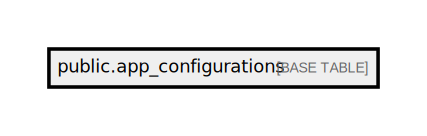

# public.app_configurations

## Description

## Columns

| Name                         | Type                           | Default                                        | Nullable |
| ---------------------------- | ------------------------------ | ---------------------------------------------- | -------- |
| id                           | bigint                         | nextval('app_configurations_id_seq'::regclass) | false    |
| ios_force_update             | boolean                        |                                                | false    |
| ios_new_version              | varchar(255)                   |                                                | false    |
| android_force_update         | boolean                        |                                                | false    |
| android_new_version          | varchar(255)                   |                                                | false    |
| test_data_version            | integer                        |                                                | false    |
| created_at                   | timestamp(0) without time zone |                                                | true     |
| updated_at                   | timestamp(0) without time zone |                                                | true     |
| digital_contract_enable      | boolean                        | true                                           | false    |
| campaign_enable              | boolean                        | false                                          | false    |
| cooperation_agreement_enable | boolean                        | true                                           | false    |
| doctor_statements_enable     | boolean                        | true                                           | false    |
| total_orders_value_enable    | boolean                        | true                                           | false    |
| banking_info_enable          | boolean                        | true                                           | false    |
| enable_mkt_notification      | boolean                        | false                                          | false    |
| ads                          | json                           |                                                | true     |

## Constraints

| Name                    | Type        | Definition       |
| ----------------------- | ----------- | ---------------- |
| app_configurations_pkey | PRIMARY KEY | PRIMARY KEY (id) |

## Indexes

| Name                    | Definition                                                                                |
| ----------------------- | ----------------------------------------------------------------------------------------- |
| app_configurations_pkey | CREATE UNIQUE INDEX app_configurations_pkey ON public.app_configurations USING btree (id) |

## Relations

---

> Generated by [tbls](https://github.com/k1LoW/tbls)
