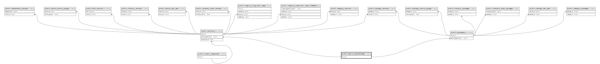

# public.attune_departments

## Description

## Columns

| Name       | Type                           | Default                                        | Nullable | Children                                                                    |
| ---------- | ------------------------------ | ---------------------------------------------- | -------- | --------------------------------------------------------------------------- |
| id         | bigint                         | nextval('attune_departments_id_seq'::regclass) | false    | [public.services](public.services.md) [public.packages](public.packages.md) |
| name       | varchar(255)                   |                                                | false    |                                                                             |
| attune_id  | varchar(255)                   |                                                | false    |                                                                             |
| created_at | timestamp(0) without time zone |                                                | true     |                                                                             |
| updated_at | timestamp(0) without time zone |                                                | true     |                                                                             |
| type       | varchar(20)                    | 'lab'::character varying                       | false    |                                                                             |
| name_vi    | varchar(255)                   |                                                | true     |                                                                             |

## Constraints

| Name                                | Type        | Definition         |
| ----------------------------------- | ----------- | ------------------ |
| attune_departments_pkey             | PRIMARY KEY | PRIMARY KEY (id)   |
| attune_departments_attune_id_unique | UNIQUE      | UNIQUE (attune_id) |

## Indexes

| Name                                | Definition                                                                                                   |
| ----------------------------------- | ------------------------------------------------------------------------------------------------------------ |
| attune_departments_pkey             | CREATE UNIQUE INDEX attune_departments_pkey ON public.attune_departments USING btree (id)                    |
| attune_departments_attune_id_unique | CREATE UNIQUE INDEX attune_departments_attune_id_unique ON public.attune_departments USING btree (attune_id) |

## Relations

---

> Generated by [tbls](https://github.com/k1LoW/tbls)
