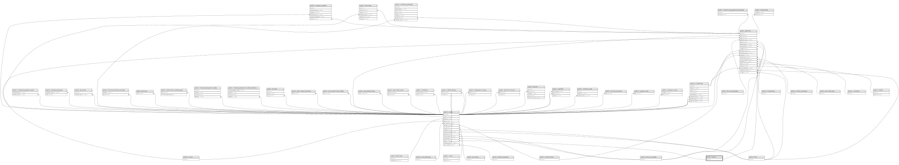

# public.banks

## Description

## Columns

| Name             | Type                           | Default                           | Nullable | Children                                                              |
| ---------------- | ------------------------------ | --------------------------------- | -------- | --------------------------------------------------------------------- |
| id               | bigint                         | nextval('banks_id_seq'::regclass) | false    | [public.users](public.users.md) [public.patients](public.patients.md) |
| name             | varchar(255)                   |                                   | false    |                                                                       |
| branch           | varchar(255)                   |                                   | false    |                                                                       |
| owner            | varchar(255)                   |                                   | false    |                                                                       |
| account_number   | varchar(255)                   |                                   | false    |                                                                       |
| created_at       | timestamp(0) without time zone |                                   | true     |                                                                       |
| updated_at       | timestamp(0) without time zone |                                   | true     |                                                                       |
| pending_approval | boolean                        | false                             | false    |                                                                       |

## Constraints

| Name       | Type        | Definition       |
| ---------- | ----------- | ---------------- |
| banks_pkey | PRIMARY KEY | PRIMARY KEY (id) |

## Indexes

| Name       | Definition                                                      |
| ---------- | --------------------------------------------------------------- |
| banks_pkey | CREATE UNIQUE INDEX banks_pkey ON public.banks USING btree (id) |

## Relations

---

> Generated by [tbls](https://github.com/k1LoW/tbls)
