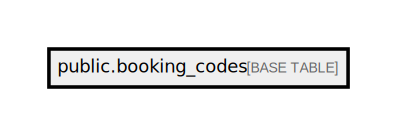

# public.booking_codes

## Description

## Columns

| Name       | Type                           | Default                                   | Nullable |
| ---------- | ------------------------------ | ----------------------------------------- | -------- |
| id         | bigint                         | nextval('booking_codes_id_seq'::regclass) | false    |
| code       | varchar(255)                   |                                           | false    |
| created_at | timestamp(0) without time zone |                                           | true     |
| updated_at | timestamp(0) without time zone |                                           | true     |
| deleted_at | timestamp(0) without time zone |                                           | true     |

## Constraints

| Name                      | Type        | Definition       |
| ------------------------- | ----------- | ---------------- |
| booking_codes_pkey        | PRIMARY KEY | PRIMARY KEY (id) |
| booking_codes_code_unique | UNIQUE      | UNIQUE (code)    |

## Indexes

| Name                      | Definition                                                                               |
| ------------------------- | ---------------------------------------------------------------------------------------- |
| booking_codes_pkey        | CREATE UNIQUE INDEX booking_codes_pkey ON public.booking_codes USING btree (id)          |
| booking_codes_code_unique | CREATE UNIQUE INDEX booking_codes_code_unique ON public.booking_codes USING btree (code) |

## Relations

---

> Generated by [tbls](https://github.com/k1LoW/tbls)
