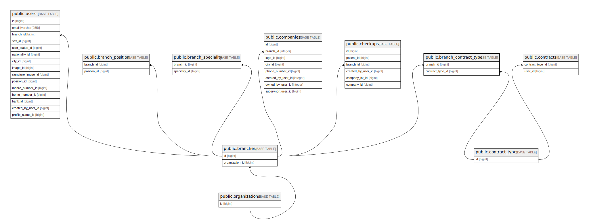

# public.branch_contract_type

## Description

## Columns

| Name             | Type   | Default                                          | Nullable | Parents                                           |
| ---------------- | ------ | ------------------------------------------------ | -------- | ------------------------------------------------- |
| id               | bigint | nextval('branch_contract_type_id_seq'::regclass) | false    |                                                   |
| branch_id        | bigint |                                                  | false    | [public.branches](public.branches.md)             |
| contract_type_id | bigint |                                                  | false    | [public.contract_types](public.contract_types.md) |

## Constraints

| Name                                          | Type        | Definition                                                                     |
| --------------------------------------------- | ----------- | ------------------------------------------------------------------------------ |
| branch_contract_type_branch_id_foreign        | FOREIGN KEY | FOREIGN KEY (branch_id) REFERENCES branches(id) ON DELETE CASCADE              |
| branch_contract_type_contract_type_id_foreign | FOREIGN KEY | FOREIGN KEY (contract_type_id) REFERENCES contract_types(id) ON DELETE CASCADE |
| branch_contract_type_pkey                     | PRIMARY KEY | PRIMARY KEY (id)                                                               |

## Indexes

| Name                      | Definition                                                                                    |
| ------------------------- | --------------------------------------------------------------------------------------------- |
| branch_contract_type_pkey | CREATE UNIQUE INDEX branch_contract_type_pkey ON public.branch_contract_type USING btree (id) |

## Relations

---

> Generated by [tbls](https://github.com/k1LoW/tbls)
