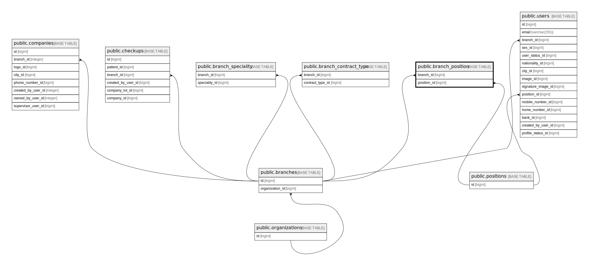

# public.branch_position

## Description

## Columns

| Name        | Type   | Default                                     | Nullable | Parents                                 |
| ----------- | ------ | ------------------------------------------- | -------- | --------------------------------------- |
| id          | bigint | nextval('branch_position_id_seq'::regclass) | false    |                                         |
| branch_id   | bigint |                                             | false    | [public.branches](public.branches.md)   |
| position_id | bigint |                                             | false    | [public.positions](public.positions.md) |

## Constraints

| Name                                | Type        | Definition                                                           |
| ----------------------------------- | ----------- | -------------------------------------------------------------------- |
| branch_position_branch_id_foreign   | FOREIGN KEY | FOREIGN KEY (branch_id) REFERENCES branches(id) ON DELETE CASCADE    |
| branch_position_position_id_foreign | FOREIGN KEY | FOREIGN KEY (position_id) REFERENCES positions(id) ON DELETE CASCADE |
| branch_position_pkey                | PRIMARY KEY | PRIMARY KEY (id)                                                     |

## Indexes

| Name                 | Definition                                                                          |
| -------------------- | ----------------------------------------------------------------------------------- |
| branch_position_pkey | CREATE UNIQUE INDEX branch_position_pkey ON public.branch_position USING btree (id) |

## Relations

---

> Generated by [tbls](https://github.com/k1LoW/tbls)
