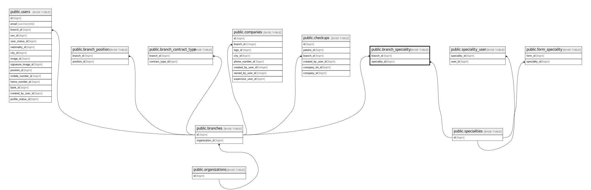

# public.branch_speciality

## Description

## Columns

| Name          | Type   | Default                                       | Nullable | Parents                                       |
| ------------- | ------ | --------------------------------------------- | -------- | --------------------------------------------- |
| id            | bigint | nextval('branch_speciality_id_seq'::regclass) | false    |                                               |
| branch_id     | bigint |                                               | false    | [public.branches](public.branches.md)         |
| speciality_id | bigint |                                               | false    | [public.specialities](public.specialities.md) |

## Constraints

| Name                                    | Type        | Definition                                                                |
| --------------------------------------- | ----------- | ------------------------------------------------------------------------- |
| branch_speciality_branch_id_foreign     | FOREIGN KEY | FOREIGN KEY (branch_id) REFERENCES branches(id) ON DELETE CASCADE         |
| branch_speciality_speciality_id_foreign | FOREIGN KEY | FOREIGN KEY (speciality_id) REFERENCES specialities(id) ON DELETE CASCADE |
| branch_speciality_pkey                  | PRIMARY KEY | PRIMARY KEY (id)                                                          |

## Indexes

| Name                   | Definition                                                                              |
| ---------------------- | --------------------------------------------------------------------------------------- |
| branch_speciality_pkey | CREATE UNIQUE INDEX branch_speciality_pkey ON public.branch_speciality USING btree (id) |

## Relations

---

> Generated by [tbls](https://github.com/k1LoW/tbls)
