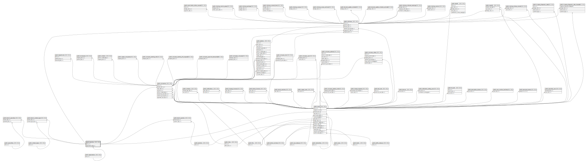

# public.branches

## Description

## Columns

| Name            | Type                           | Default                              | Nullable | Children                                                                                                                                                                                                                                                                                | Parents                                         |
| --------------- | ------------------------------ | ------------------------------------ | -------- | --------------------------------------------------------------------------------------------------------------------------------------------------------------------------------------------------------------------------------------------------------------------------------------- | ----------------------------------------------- |
| id              | bigint                         | nextval('branches_id_seq'::regclass) | false    | [public.users](public.users.md) [public.branch_position](public.branch_position.md) [public.branch_speciality](public.branch_speciality.md) [public.branch_contract_type](public.branch_contract_type.md) [public.companies](public.companies.md) [public.checkups](public.checkups.md) |                                                 |
| name            | varchar(255)                   |                                      | false    |                                                                                                                                                                                                                                                                                         |                                                 |
| organization_id | bigint                         |                                      | false    |                                                                                                                                                                                                                                                                                         | [public.organizations](public.organizations.md) |
| created_at      | timestamp(0) without time zone |                                      | true     |                                                                                                                                                                                                                                                                                         |                                                 |
| updated_at      | timestamp(0) without time zone |                                      | true     |                                                                                                                                                                                                                                                                                         |                                                 |

## Constraints

| Name                             | Type        | Definition                                                                   |
| -------------------------------- | ----------- | ---------------------------------------------------------------------------- |
| branches_organization_id_foreign | FOREIGN KEY | FOREIGN KEY (organization_id) REFERENCES organizations(id) ON DELETE CASCADE |
| branches_pkey                    | PRIMARY KEY | PRIMARY KEY (id)                                                             |

## Indexes

| Name          | Definition                                                            |
| ------------- | --------------------------------------------------------------------- |
| branches_pkey | CREATE UNIQUE INDEX branches_pkey ON public.branches USING btree (id) |

## Relations

---

> Generated by [tbls](https://github.com/k1LoW/tbls)
