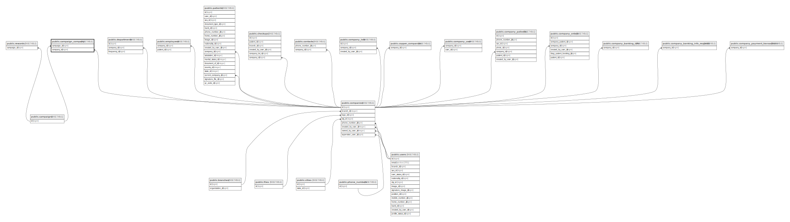

# public.campaign_company

## Description

## Columns

| Name        | Type                           | Default                                      | Nullable | Parents                                 |
| ----------- | ------------------------------ | -------------------------------------------- | -------- | --------------------------------------- |
| id          | bigint                         | nextval('campaign_company_id_seq'::regclass) | false    |                                         |
| campaign_id | bigint                         |                                              | true     | [public.campaigns](public.campaigns.md) |
| company_id  | bigint                         |                                              | true     | [public.companies](public.companies.md) |
| status      | varchar(255)                   | 'not-started'::character varying             | false    |                                         |
| metadata    | json                           |                                              | true     |                                         |
| created_at  | timestamp(0) without time zone |                                              | true     |                                         |
| updated_at  | timestamp(0) without time zone |                                              | true     |                                         |

## Constraints

| Name                                           | Type        | Definition                                                           |
| ---------------------------------------------- | ----------- | -------------------------------------------------------------------- |
| campaign_company_company_id_foreign            | FOREIGN KEY | FOREIGN KEY (company_id) REFERENCES companies(id) ON DELETE CASCADE  |
| campaign_company_campaign_id_foreign           | FOREIGN KEY | FOREIGN KEY (campaign_id) REFERENCES campaigns(id) ON DELETE CASCADE |
| campaign_company_pkey                          | PRIMARY KEY | PRIMARY KEY (id)                                                     |
| campaign_company_campaign_id_company_id_unique | UNIQUE      | UNIQUE (campaign_id, company_id)                                     |

## Indexes

| Name                                           | Definition                                                                                                                          |
| ---------------------------------------------- | ----------------------------------------------------------------------------------------------------------------------------------- |
| campaign_company_pkey                          | CREATE UNIQUE INDEX campaign_company_pkey ON public.campaign_company USING btree (id)                                               |
| campaign_company_campaign_id_company_id_unique | CREATE UNIQUE INDEX campaign_company_campaign_id_company_id_unique ON public.campaign_company USING btree (campaign_id, company_id) |

## Relations

---

> Generated by [tbls](https://github.com/k1LoW/tbls)
