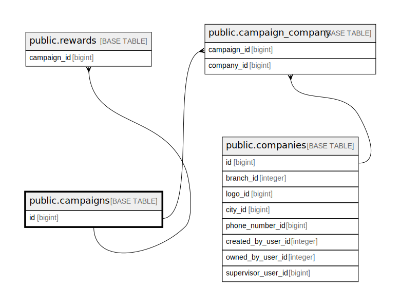

# public.campaigns

## Description

## Columns

| Name       | Type                           | Default                               | Nullable | Children                                                                                  |
| ---------- | ------------------------------ | ------------------------------------- | -------- | ----------------------------------------------------------------------------------------- |
| id         | bigint                         | nextval('campaigns_id_seq'::regclass) | false    | [public.rewards](public.rewards.md) [public.campaign_company](public.campaign_company.md) |
| type       | varchar(255)                   |                                       | false    |                                                                                           |
| name       | varchar(255)                   |                                       | false    |                                                                                           |
| name_vi    | varchar(255)                   |                                       | false    |                                                                                           |
| classname  | varchar(255)                   |                                       | false    |                                                                                           |
| start_date | timestamp(0) without time zone |                                       | false    |                                                                                           |
| end_date   | timestamp(0) without time zone |                                       | false    |                                                                                           |
| created_at | timestamp(0) without time zone |                                       | true     |                                                                                           |
| updated_at | timestamp(0) without time zone |                                       | true     |                                                                                           |

## Constraints

| Name           | Type        | Definition       |
| -------------- | ----------- | ---------------- |
| campaigns_pkey | PRIMARY KEY | PRIMARY KEY (id) |

## Indexes

| Name           | Definition                                                              |
| -------------- | ----------------------------------------------------------------------- |
| campaigns_pkey | CREATE UNIQUE INDEX campaigns_pkey ON public.campaigns USING btree (id) |

## Relations

---

> Generated by [tbls](https://github.com/k1LoW/tbls)
