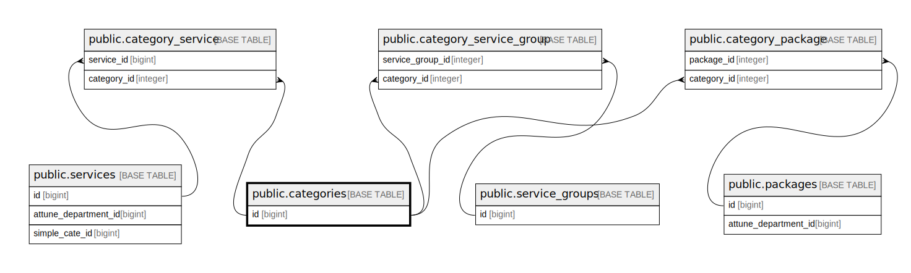

# public.categories

## Description

## Columns

| Name       | Type                           | Default                                | Nullable | Children                                                                                                                                                                      |
| ---------- | ------------------------------ | -------------------------------------- | -------- | ----------------------------------------------------------------------------------------------------------------------------------------------------------------------------- |
| id         | bigint                         | nextval('categories_id_seq'::regclass) | false    | [public.category_service](public.category_service.md) [public.category_service_group](public.category_service_group.md) [public.category_package](public.category_package.md) |
| name       | varchar(255)                   |                                        | false    |                                                                                                                                                                               |
| name_vi    | varchar(255)                   |                                        | false    |                                                                                                                                                                               |
| created_at | timestamp(0) without time zone |                                        | true     |                                                                                                                                                                               |
| updated_at | timestamp(0) without time zone |                                        | true     |                                                                                                                                                                               |

## Constraints

| Name            | Type        | Definition       |
| --------------- | ----------- | ---------------- |
| categories_pkey | PRIMARY KEY | PRIMARY KEY (id) |

## Indexes

| Name            | Definition                                                                |
| --------------- | ------------------------------------------------------------------------- |
| categories_pkey | CREATE UNIQUE INDEX categories_pkey ON public.categories USING btree (id) |

## Relations

---

> Generated by [tbls](https://github.com/k1LoW/tbls)
