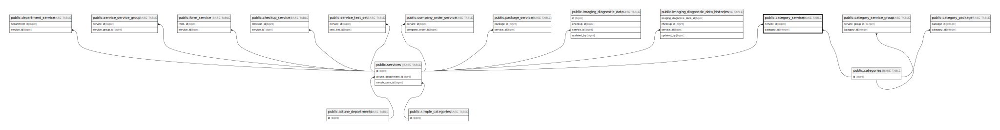

# public.category_service

## Description

## Columns

| Name        | Type                           | Default                                      | Nullable | Parents                                   |
| ----------- | ------------------------------ | -------------------------------------------- | -------- | ----------------------------------------- |
| id          | bigint                         | nextval('category_service_id_seq'::regclass) | false    |                                           |
| service_id  | bigint                         |                                              | false    | [public.services](public.services.md)     |
| category_id | integer                        |                                              | false    | [public.categories](public.categories.md) |
| created_at  | timestamp(0) without time zone |                                              | true     |                                           |
| updated_at  | timestamp(0) without time zone |                                              | true     |                                           |

## Constraints

| Name                                 | Type        | Definition                                                            |
| ------------------------------------ | ----------- | --------------------------------------------------------------------- |
| category_service_service_id_foreign  | FOREIGN KEY | FOREIGN KEY (service_id) REFERENCES services(id) ON DELETE CASCADE    |
| category_service_category_id_foreign | FOREIGN KEY | FOREIGN KEY (category_id) REFERENCES categories(id) ON DELETE CASCADE |
| category_service_pkey                | PRIMARY KEY | PRIMARY KEY (id)                                                      |

## Indexes

| Name                  | Definition                                                                            |
| --------------------- | ------------------------------------------------------------------------------------- |
| category_service_pkey | CREATE UNIQUE INDEX category_service_pkey ON public.category_service USING btree (id) |

## Relations

---

> Generated by [tbls](https://github.com/k1LoW/tbls)
