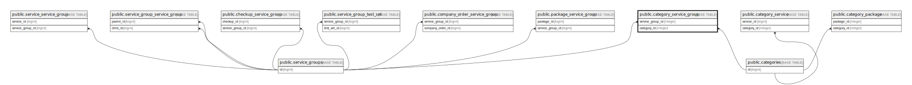

# public.category_service_group

## Description

## Columns

| Name             | Type                           | Default                                            | Nullable | Parents                                           |
| ---------------- | ------------------------------ | -------------------------------------------------- | -------- | ------------------------------------------------- |
| id               | bigint                         | nextval('category_service_group_id_seq'::regclass) | false    |                                                   |
| service_group_id | integer                        |                                                    | false    | [public.service_groups](public.service_groups.md) |
| category_id      | integer                        |                                                    | false    | [public.categories](public.categories.md)         |
| created_at       | timestamp(0) without time zone |                                                    | true     |                                                   |
| updated_at       | timestamp(0) without time zone |                                                    | true     |                                                   |

## Constraints

| Name                                            | Type        | Definition                                                                     |
| ----------------------------------------------- | ----------- | ------------------------------------------------------------------------------ |
| category_service_group_service_group_id_foreign | FOREIGN KEY | FOREIGN KEY (service_group_id) REFERENCES service_groups(id) ON DELETE CASCADE |
| category_service_group_category_id_foreign      | FOREIGN KEY | FOREIGN KEY (category_id) REFERENCES categories(id) ON DELETE CASCADE          |
| category_service_group_pkey                     | PRIMARY KEY | PRIMARY KEY (id)                                                               |

## Indexes

| Name                        | Definition                                                                                        |
| --------------------------- | ------------------------------------------------------------------------------------------------- |
| category_service_group_pkey | CREATE UNIQUE INDEX category_service_group_pkey ON public.category_service_group USING btree (id) |

## Relations

---

> Generated by [tbls](https://github.com/k1LoW/tbls)
