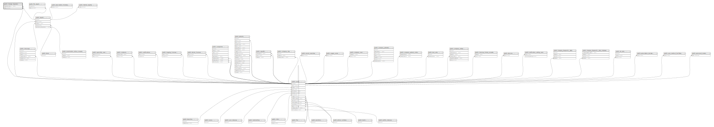

# public.change_requests

## Description

## Columns

| Name                 | Type                           | Default                                     | Nullable | Parents                             |
| -------------------- | ------------------------------ | ------------------------------------------- | -------- | ----------------------------------- |
| id                   | bigint                         | nextval('change_requests_id_seq'::regclass) | false    |                                     |
| requested_by_user_id | bigint                         |                                             | false    | [public.users](public.users.md)     |
| report_id            | bigint                         |                                             | false    | [public.reports](public.reports.md) |
| type                 | text                           |                                             | false    |                                     |
| change               | varchar(255)                   |                                             | false    |                                     |
| reason               | text                           |                                             | false    |                                     |
| created_at           | timestamp(0) without time zone |                                             | true     |                                     |
| updated_at           | timestamp(0) without time zone |                                             | true     |                                     |

## Constraints

| Name                                         | Type        | Definition                                                                |
| -------------------------------------------- | ----------- | ------------------------------------------------------------------------- |
| change_requests_requested_by_user_id_foreign | FOREIGN KEY | FOREIGN KEY (requested_by_user_id) REFERENCES users(id) ON DELETE CASCADE |
| change_requests_report_id_foreign            | FOREIGN KEY | FOREIGN KEY (report_id) REFERENCES reports(id) ON DELETE CASCADE          |
| change_requests_pkey                         | PRIMARY KEY | PRIMARY KEY (id)                                                          |

## Indexes

| Name                 | Definition                                                                          |
| -------------------- | ----------------------------------------------------------------------------------- |
| change_requests_pkey | CREATE UNIQUE INDEX change_requests_pkey ON public.change_requests USING btree (id) |

## Relations

---

> Generated by [tbls](https://github.com/k1LoW/tbls)
