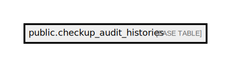

# public.checkup_audit_histories

## Description

## Columns

| Name           | Type                           | Default                                             | Nullable |
| -------------- | ------------------------------ | --------------------------------------------------- | -------- |
| id             | bigint                         | nextval('checkup_audit_histories_id_seq'::regclass) | false    |
| checkup_id     | bigint                         |                                                     | false    |
| status         | varchar(255)                   |                                                     | false    |
| event          | varchar(255)                   |                                                     | false    |
| visit_date     | timestamp(0) without time zone |                                                     | true     |
| checked_out_at | timestamp(0) without time zone |                                                     | true     |
| created_at     | timestamp(0) without time zone |                                                     | true     |
| updated_at     | timestamp(0) without time zone |                                                     | true     |
| updated_by     | json                           |                                                     | true     |
| event_code     | varchar(255)                   |                                                     | true     |
| extra_data     | json                           |                                                     | true     |

## Constraints

| Name                         | Type        | Definition       |
| ---------------------------- | ----------- | ---------------- |
| checkup_audit_histories_pkey | PRIMARY KEY | PRIMARY KEY (id) |

## Indexes

| Name                         | Definition                                                                                          |
| ---------------------------- | --------------------------------------------------------------------------------------------------- |
| checkup_audit_histories_pkey | CREATE UNIQUE INDEX checkup_audit_histories_pkey ON public.checkup_audit_histories USING btree (id) |

## Relations

---

> Generated by [tbls](https://github.com/k1LoW/tbls)
