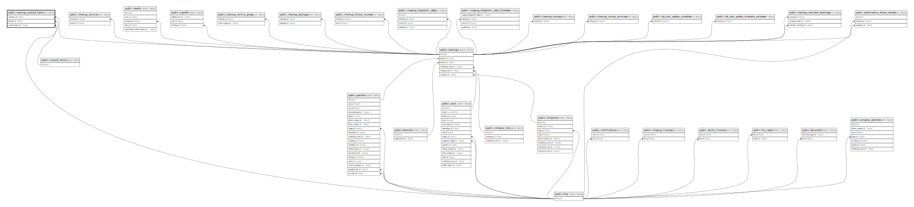

# public.checkup_consent_form

## Description

## Columns

| Name            | Type                           | Default                                          | Nullable | Parents                                         |
| --------------- | ------------------------------ | ------------------------------------------------ | -------- | ----------------------------------------------- |
| id              | bigint                         | nextval('checkup_consent_form_id_seq'::regclass) | false    |                                                 |
| checkup_id      | bigint                         |                                                  | false    | [public.checkups](public.checkups.md)           |
| pdf_file_id     | bigint                         |                                                  | true     | [public.files](public.files.md)                 |
| consent_form_id | bigint                         |                                                  | false    | [public.consent_forms](public.consent_forms.md) |
| json_content    | json                           |                                                  | false    |                                                 |
| signed_at       | timestamp(0) without time zone |                                                  | true     |                                                 |
| created_at      | timestamp(0) without time zone |                                                  | true     |                                                 |
| updated_at      | timestamp(0) without time zone |                                                  | true     |                                                 |

## Constraints

| Name                                                   | Type        | Definition                                                                   |
| ------------------------------------------------------ | ----------- | ---------------------------------------------------------------------------- |
| checkup_consent_form_pdf_file_id_foreign               | FOREIGN KEY | FOREIGN KEY (pdf_file_id) REFERENCES files(id) ON DELETE SET NULL            |
| checkup_consent_form_checkup_id_foreign                | FOREIGN KEY | FOREIGN KEY (checkup_id) REFERENCES checkups(id) ON DELETE CASCADE           |
| checkup_consent_form_consent_form_id_foreign           | FOREIGN KEY | FOREIGN KEY (consent_form_id) REFERENCES consent_forms(id) ON DELETE CASCADE |
| checkup_consent_form_pkey                              | PRIMARY KEY | PRIMARY KEY (id)                                                             |
| checkup_consent_form_checkup_id_consent_form_id_unique | UNIQUE      | UNIQUE (checkup_id, consent_form_id)                                         |

## Indexes

| Name                                                   | Definition                                                                                                                                          |
| ------------------------------------------------------ | --------------------------------------------------------------------------------------------------------------------------------------------------- |
| checkup_consent_form_pkey                              | CREATE UNIQUE INDEX checkup_consent_form_pkey ON public.checkup_consent_form USING btree (id)                                                       |
| checkup_consent_form_checkup_id_consent_form_id_unique | CREATE UNIQUE INDEX checkup_consent_form_checkup_id_consent_form_id_unique ON public.checkup_consent_form USING btree (checkup_id, consent_form_id) |
| checkup_consent_form_checkup_id_index                  | CREATE INDEX checkup_consent_form_checkup_id_index ON public.checkup_consent_form USING btree (checkup_id)                                          |
| checkup_consent_form_consent_form_id_index             | CREATE INDEX checkup_consent_form_consent_form_id_index ON public.checkup_consent_form USING btree (consent_form_id)                                |
| checkup_consent_form_pdf_file_id_index                 | CREATE INDEX checkup_consent_form_pdf_file_id_index ON public.checkup_consent_form USING btree (pdf_file_id)                                        |

## Relations

---

> Generated by [tbls](https://github.com/k1LoW/tbls)
