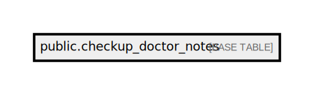

# public.checkup_doctor_notes

## Description

## Columns

| Name                 | Type                           | Default                                          | Nullable | Comment                                |
| -------------------- | ------------------------------ | ------------------------------------------------ | -------- | -------------------------------------- |
| id                   | bigint                         | nextval('checkup_doctor_notes_id_seq'::regclass) | false    |                                        |
| checkup_id           | bigint                         |                                                  | false    |                                        |
| ticket_id            | bigint                         |                                                  | false    | Freshdesk ticket ID                    |
| doctor_name          | varchar(255)                   |                                                  | false    | Doctor name                            |
| doctor_note          | text                           |                                                  | true     | Doctor note                            |
| get_doctor_note_time | timestamp(0) without time zone |                                                  | true     | Time to get doctor note from freshdesk |
| created_at           | timestamp(0) without time zone |                                                  | true     |                                        |
| updated_at           | timestamp(0) without time zone |                                                  | true     |                                        |

## Constraints

| Name                      | Type        | Definition       |
| ------------------------- | ----------- | ---------------- |
| checkup_doctor_notes_pkey | PRIMARY KEY | PRIMARY KEY (id) |

## Indexes

| Name                      | Definition                                                                                    |
| ------------------------- | --------------------------------------------------------------------------------------------- |
| checkup_doctor_notes_pkey | CREATE UNIQUE INDEX checkup_doctor_notes_pkey ON public.checkup_doctor_notes USING btree (id) |

## Relations

---

> Generated by [tbls](https://github.com/k1LoW/tbls)
