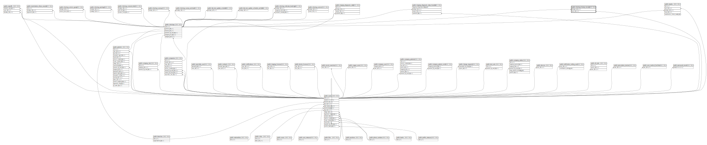

# public.checkup_history_records

## Description

## Columns

| Name       | Type                           | Default                                             | Nullable | Parents                               |
| ---------- | ------------------------------ | --------------------------------------------------- | -------- | ------------------------------------- |
| id         | bigint                         | nextval('checkup_history_records_id_seq'::regclass) | false    |                                       |
| checkup_id | bigint                         |                                                     | false    | [public.checkups](public.checkups.md) |
| user_id    | bigint                         |                                                     | true     | [public.users](public.users.md)       |
| event_type | varchar(255)                   |                                                     | true     |                                       |
| created_at | timestamp(0) without time zone |                                                     | true     |                                       |
| updated_at | timestamp(0) without time zone |                                                     | true     |                                       |

## Constraints

| Name                                       | Type        | Definition                                                         |
| ------------------------------------------ | ----------- | ------------------------------------------------------------------ |
| checkup_history_records_user_id_foreign    | FOREIGN KEY | FOREIGN KEY (user_id) REFERENCES users(id) ON DELETE CASCADE       |
| checkup_history_records_checkup_id_foreign | FOREIGN KEY | FOREIGN KEY (checkup_id) REFERENCES checkups(id) ON DELETE CASCADE |
| checkup_history_records_pkey               | PRIMARY KEY | PRIMARY KEY (id)                                                   |

## Indexes

| Name                                                 | Definition                                                                                                                               |
| ---------------------------------------------------- | ---------------------------------------------------------------------------------------------------------------------------------------- |
| checkup_history_records_pkey                         | CREATE UNIQUE INDEX checkup_history_records_pkey ON public.checkup_history_records USING btree (id)                                      |
| checkup_history_records__checkup_id_event_type_index | CREATE INDEX checkup_history_records__checkup_id_event_type_index ON public.checkup_history_records USING btree (checkup_id, event_type) |
| checkup_history_records__checkup_id_index            | CREATE INDEX checkup_history_records__checkup_id_index ON public.checkup_history_records USING btree (checkup_id)                        |

## Relations

---

> Generated by [tbls](https://github.com/k1LoW/tbls)
