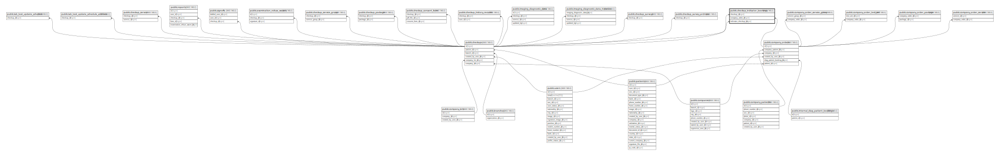

# public.checkup_indicator_bookings

## Description

## Columns

| Name                 | Type                           | Default                                                | Nullable | Parents                                           |
| -------------------- | ------------------------------ | ------------------------------------------------------ | -------- | ------------------------------------------------- |
| id                   | bigint                         | nextval('checkup_indicator_bookings_id_seq'::regclass) | false    |                                                   |
| checkup_id           | bigint                         |                                                        | false    | [public.checkups](public.checkups.md)             |
| company_order_id     | bigint                         |                                                        | false    | [public.company_orders](public.company_orders.md) |
| indicator_checkup_id | bigint                         |                                                        | true     | [public.checkups](public.checkups.md)             |
| created_at           | timestamp(0) without time zone |                                                        | true     |                                                   |
| updated_at           | timestamp(0) without time zone |                                                        | true     |                                                   |

## Constraints

| Name                                                    | Type        | Definition                                                   |
| ------------------------------------------------------- | ----------- | ------------------------------------------------------------ |
| checkup_indicator_bookings_checkup_id_foreign           | FOREIGN KEY | FOREIGN KEY (checkup_id) REFERENCES checkups(id)             |
| checkup_indicator_bookings_indicator_checkup_id_foreign | FOREIGN KEY | FOREIGN KEY (indicator_checkup_id) REFERENCES checkups(id)   |
| checkup_indicator_bookings_company_order_id_foreign     | FOREIGN KEY | FOREIGN KEY (company_order_id) REFERENCES company_orders(id) |
| checkup_indicator_bookings_pkey                         | PRIMARY KEY | PRIMARY KEY (id)                                             |
| checkup_indicator_bookings_company_order_id_unique      | UNIQUE      | UNIQUE (company_order_id)                                    |
| checkup_indicator_bookings_indicator_checkup_id_unique  | UNIQUE      | UNIQUE (indicator_checkup_id)                                |

## Indexes

| Name                                                   | Definition                                                                                                                                         |
| ------------------------------------------------------ | -------------------------------------------------------------------------------------------------------------------------------------------------- |
| checkup_indicator_bookings_pkey                        | CREATE UNIQUE INDEX checkup_indicator_bookings_pkey ON public.checkup_indicator_bookings USING btree (id)                                          |
| checkup_indicator_bookings_company_order_id_unique     | CREATE UNIQUE INDEX checkup_indicator_bookings_company_order_id_unique ON public.checkup_indicator_bookings USING btree (company_order_id)         |
| checkup_indicator_bookings_indicator_checkup_id_unique | CREATE UNIQUE INDEX checkup_indicator_bookings_indicator_checkup_id_unique ON public.checkup_indicator_bookings USING btree (indicator_checkup_id) |

## Relations

---

> Generated by [tbls](https://github.com/k1LoW/tbls)
