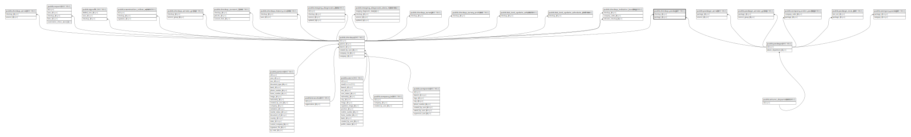

# public.checkup_package

## Description

## Columns

| Name       | Type   | Default                                     | Nullable | Parents                               |
| ---------- | ------ | ------------------------------------------- | -------- | ------------------------------------- |
| id         | bigint | nextval('checkup_package_id_seq'::regclass) | false    |                                       |
| checkup_id | bigint |                                             | false    | [public.checkups](public.checkups.md) |
| package_id | bigint |                                             | false    | [public.packages](public.packages.md) |

## Constraints

| Name                               | Type        | Definition                                                         |
| ---------------------------------- | ----------- | ------------------------------------------------------------------ |
| checkup_package_checkup_id_foreign | FOREIGN KEY | FOREIGN KEY (checkup_id) REFERENCES checkups(id) ON DELETE CASCADE |
| checkup_package_package_id_foreign | FOREIGN KEY | FOREIGN KEY (package_id) REFERENCES packages(id) ON DELETE CASCADE |
| checkup_package_pkey               | PRIMARY KEY | PRIMARY KEY (id)                                                   |

## Indexes

| Name                             | Definition                                                                                       |
| -------------------------------- | ------------------------------------------------------------------------------------------------ |
| checkup_package_pkey             | CREATE UNIQUE INDEX checkup_package_pkey ON public.checkup_package USING btree (id)              |
| checkup_package_checkup_id_index | CREATE INDEX checkup_package_checkup_id_index ON public.checkup_package USING btree (checkup_id) |
| checkup_package_package_id_index | CREATE INDEX checkup_package_package_id_index ON public.checkup_package USING btree (package_id) |

## Relations

---

> Generated by [tbls](https://github.com/k1LoW/tbls)
