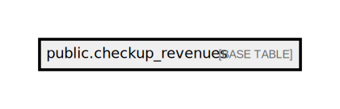

# public.checkup_revenues

## Description

## Columns

| Name           | Type                           | Default                                      | Nullable |
| -------------- | ------------------------------ | -------------------------------------------- | -------- |
| id             | bigint                         | nextval('checkup_revenues_id_seq'::regclass) | false    |
| access_number  | varchar(255)                   |                                              | false    |
| amount         | numeric(150,2)                 |                                              | false    |
| invoice_number | varchar(255)                   |                                              | false    |
| test_id        | varchar(255)                   |                                              | false    |
| created_at     | timestamp(0) without time zone |                                              | true     |
| updated_at     | timestamp(0) without time zone |                                              | true     |
| test_code      | varchar(255)                   |                                              | true     |

## Constraints

| Name                                                            | Type        | Definition                                                |
| --------------------------------------------------------------- | ----------- | --------------------------------------------------------- |
| checkup_revenues_pkey                                           | PRIMARY KEY | PRIMARY KEY (id)                                          |
| checkup_revenues_access_number_invoice_number_test_code_amount_ | UNIQUE      | UNIQUE (access_number, invoice_number, test_code, amount) |

## Indexes

| Name                                                            | Definition                                                                                                                                                                    |
| --------------------------------------------------------------- | ----------------------------------------------------------------------------------------------------------------------------------------------------------------------------- |
| checkup_revenues_pkey                                           | CREATE UNIQUE INDEX checkup_revenues_pkey ON public.checkup_revenues USING btree (id)                                                                                         |
| checkup_revenues_access_number_index                            | CREATE INDEX checkup_revenues_access_number_index ON public.checkup_revenues USING btree (access_number)                                                                      |
| checkup_revenues_access_number_invoice_number_test_code_amount_ | CREATE UNIQUE INDEX checkup_revenues_access_number_invoice_number_test_code_amount_ ON public.checkup_revenues USING btree (access_number, invoice_number, test_code, amount) |

## Relations

---

> Generated by [tbls](https://github.com/k1LoW/tbls)
