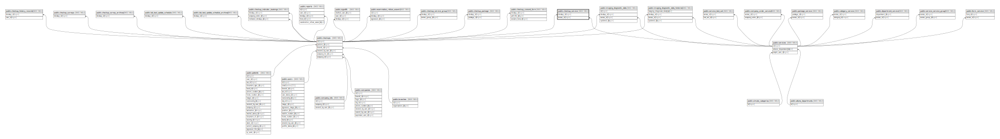

# public.checkup_service

## Description

## Columns

| Name           | Type                           | Default                                     | Nullable | Parents                               |
| -------------- | ------------------------------ | ------------------------------------------- | -------- | ------------------------------------- |
| id             | bigint                         | nextval('checkup_service_id_seq'::regclass) | false    |                                       |
| checkup_id     | bigint                         |                                             | false    | [public.checkups](public.checkups.md) |
| service_id     | bigint                         |                                             | false    | [public.services](public.services.md) |
| order_priority | integer                        |                                             | true     |                                       |
| status         | varchar(30)                    |                                             | true     |                                       |
| created_at     | timestamp(0) without time zone |                                             | true     |                                       |
| updated_at     | timestamp(0) without time zone |                                             | true     |                                       |

## Constraints

| Name                               | Type        | Definition                                                         |
| ---------------------------------- | ----------- | ------------------------------------------------------------------ |
| checkup_service_service_id_foreign | FOREIGN KEY | FOREIGN KEY (service_id) REFERENCES services(id) ON DELETE CASCADE |
| checkup_service_checkup_id_foreign | FOREIGN KEY | FOREIGN KEY (checkup_id) REFERENCES checkups(id) ON DELETE CASCADE |
| checkup_service_pkey               | PRIMARY KEY | PRIMARY KEY (id)                                                   |

## Indexes

| Name                             | Definition                                                                                                                                |
| -------------------------------- | ----------------------------------------------------------------------------------------------------------------------------------------- |
| checkup_service_pkey             | CREATE UNIQUE INDEX checkup_service_pkey ON public.checkup_service USING btree (id)                                                       |
| checkup_service_checkup_id_index | CREATE INDEX checkup_service_checkup_id_index ON public.checkup_service USING btree (checkup_id)                                          |
| checkup_service_service_id_index | CREATE INDEX checkup_service_service_id_index ON public.checkup_service USING btree (service_id)                                          |
| checkup_service_updated_at_index | CREATE INDEX checkup_service_updated_at_index ON public.checkup_service USING btree (updated_at)                                          |
| checkup_service_status_index     | CREATE INDEX checkup_service_status_index ON public.checkup_service USING btree (status)                                                  |
| checkupsapi_cs_service_upd_cover | CREATE INDEX checkupsapi_cs_service_upd_cover ON public.checkup_service USING btree (service_id, updated_at) INCLUDE (checkup_id, status) |
| checkupsapi_cs_status            | CREATE INDEX checkupsapi_cs_status ON public.checkup_service USING btree (status) INCLUDE (service_id) WHERE (status IS NOT NULL)         |

## Relations

---

> Generated by [tbls](https://github.com/k1LoW/tbls)
