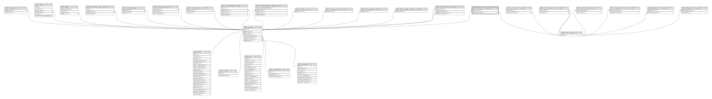

# public.checkup_service_group

## Description

## Columns

| Name             | Type   | Default                                           | Nullable | Parents                                           |
| ---------------- | ------ | ------------------------------------------------- | -------- | ------------------------------------------------- |
| id               | bigint | nextval('checkup_service_group_id_seq'::regclass) | false    |                                                   |
| checkup_id       | bigint |                                                   | false    | [public.checkups](public.checkups.md)             |
| service_group_id | bigint |                                                   | false    | [public.service_groups](public.service_groups.md) |

## Constraints

| Name                                           | Type        | Definition                                                                     |
| ---------------------------------------------- | ----------- | ------------------------------------------------------------------------------ |
| checkup_service_group_service_group_id_foreign | FOREIGN KEY | FOREIGN KEY (service_group_id) REFERENCES service_groups(id) ON DELETE CASCADE |
| checkup_service_group_checkup_id_foreign       | FOREIGN KEY | FOREIGN KEY (checkup_id) REFERENCES checkups(id) ON DELETE CASCADE             |
| checkup_service_group_pkey                     | PRIMARY KEY | PRIMARY KEY (id)                                                               |

## Indexes

| Name                                         | Definition                                                                                                               |
| -------------------------------------------- | ------------------------------------------------------------------------------------------------------------------------ |
| checkup_service_group_pkey                   | CREATE UNIQUE INDEX checkup_service_group_pkey ON public.checkup_service_group USING btree (id)                          |
| checkup_service_group_checkup_id_index       | CREATE INDEX checkup_service_group_checkup_id_index ON public.checkup_service_group USING btree (checkup_id)             |
| checkup_service_group_service_group_id_index | CREATE INDEX checkup_service_group_service_group_id_index ON public.checkup_service_group USING btree (service_group_id) |

## Relations

---

> Generated by [tbls](https://github.com/k1LoW/tbls)
