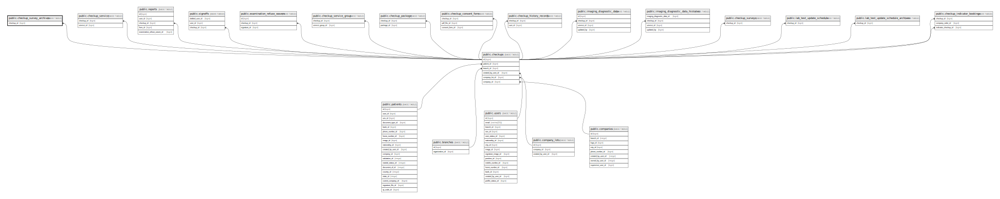

# public.checkup_survey_archives

## Description

## Columns

| Name         | Type                           | Default                                             | Nullable | Parents                               |
| ------------ | ------------------------------ | --------------------------------------------------- | -------- | ------------------------------------- |
| id           | bigint                         | nextval('checkup_survey_archives_id_seq'::regclass) | false    |                                       |
| checkup_id   | bigint                         |                                                     | false    | [public.checkups](public.checkups.md) |
| triggered_at | timestamp(0) without time zone |                                                     | false    |                                       |
| created_at   | timestamp(0) without time zone |                                                     | true     |                                       |
| updated_at   | timestamp(0) without time zone |                                                     | true     |                                       |

## Constraints

| Name                                       | Type        | Definition                                       |
| ------------------------------------------ | ----------- | ------------------------------------------------ |
| checkup_survey_archives_checkup_id_foreign | FOREIGN KEY | FOREIGN KEY (checkup_id) REFERENCES checkups(id) |
| checkup_survey_archives_pkey               | PRIMARY KEY | PRIMARY KEY (id)                                 |

## Indexes

| Name                                     | Definition                                                                                                       |
| ---------------------------------------- | ---------------------------------------------------------------------------------------------------------------- |
| checkup_survey_archives_pkey             | CREATE UNIQUE INDEX checkup_survey_archives_pkey ON public.checkup_survey_archives USING btree (id)              |
| checkup_survey_archives_checkup_id_index | CREATE INDEX checkup_survey_archives_checkup_id_index ON public.checkup_survey_archives USING btree (checkup_id) |

## Relations

---

> Generated by [tbls](https://github.com/k1LoW/tbls)
