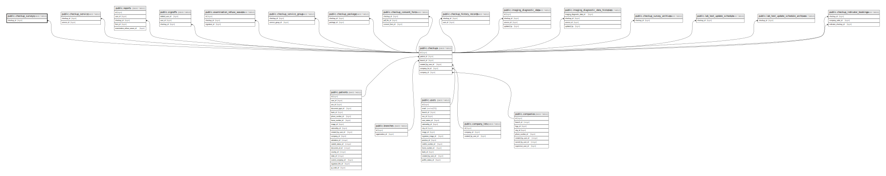

# public.checkup_surveys

## Description

## Columns

| Name         | Type                           | Default                                     | Nullable | Parents                               |
| ------------ | ------------------------------ | ------------------------------------------- | -------- | ------------------------------------- |
| id           | bigint                         | nextval('checkup_surveys_id_seq'::regclass) | false    |                                       |
| checkup_id   | bigint                         |                                             | false    | [public.checkups](public.checkups.md) |
| triggered_at | timestamp(0) without time zone |                                             | false    |                                       |
| created_at   | timestamp(0) without time zone |                                             | true     |                                       |
| updated_at   | timestamp(0) without time zone |                                             | true     |                                       |
| status       | varchar(10)                    |                                             | false    |                                       |
| extra_data   | json                           |                                             | true     |                                       |

## Constraints

| Name                               | Type        | Definition                                       |
| ---------------------------------- | ----------- | ------------------------------------------------ |
| checkup_surveys_checkup_id_foreign | FOREIGN KEY | FOREIGN KEY (checkup_id) REFERENCES checkups(id) |
| checkup_surveys_pkey               | PRIMARY KEY | PRIMARY KEY (id)                                 |

## Indexes

| Name                 | Definition                                                                          |
| -------------------- | ----------------------------------------------------------------------------------- |
| checkup_surveys_pkey | CREATE UNIQUE INDEX checkup_surveys_pkey ON public.checkup_surveys USING btree (id) |

## Relations

---

> Generated by [tbls](https://github.com/k1LoW/tbls)
