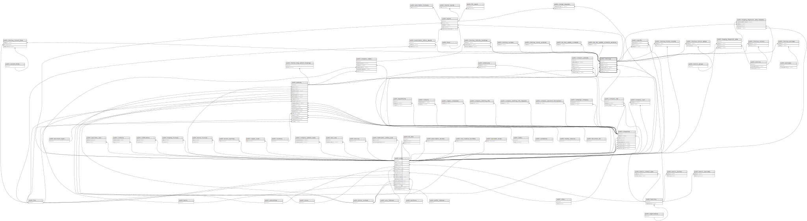

# public.checkups

## Description

## Columns

| Name                    | Type                           | Default                              | Nullable | Children                                                                                                                                                                                                                                                                                                                                                                                                                                                                                                                                                                                                                                                                                                                                                                                                                                                                                                                                                                                | Parents                                       |
| ----------------------- | ------------------------------ | ------------------------------------ | -------- | --------------------------------------------------------------------------------------------------------------------------------------------------------------------------------------------------------------------------------------------------------------------------------------------------------------------------------------------------------------------------------------------------------------------------------------------------------------------------------------------------------------------------------------------------------------------------------------------------------------------------------------------------------------------------------------------------------------------------------------------------------------------------------------------------------------------------------------------------------------------------------------------------------------------------------------------------------------------------------------- | --------------------------------------------- |
| id                      | bigint                         | nextval('checkups_id_seq'::regclass) | false    | [public.checkup_service](public.checkup_service.md) [public.reports](public.reports.md) [public.signoffs](public.signoffs.md) [public.examination_refuse_wavers](public.examination_refuse_wavers.md) [public.checkup_service_group](public.checkup_service_group.md) [public.checkup_package](public.checkup_package.md) [public.checkup_consent_form](public.checkup_consent_form.md) [public.checkup_history_records](public.checkup_history_records.md) [public.imaging_diagnostic_data](public.imaging_diagnostic_data.md) [public.imaging_diagnostic_data_histories](public.imaging_diagnostic_data_histories.md) [public.checkup_surveys](public.checkup_surveys.md) [public.checkup_survey_archives](public.checkup_survey_archives.md) [public.lab_test_update_schedule](public.lab_test_update_schedule.md) [public.lab_test_update_schedule_archives](public.lab_test_update_schedule_archives.md) [public.checkup_indicator_bookings](public.checkup_indicator_bookings.md) |                                               |
| access_number           | varchar(255)                   |                                      | true     |                                                                                                                                                                                                                                                                                                                                                                                                                                                                                                                                                                                                                                                                                                                                                                                                                                                                                                                                                                                         |                                               |
| guava_checkout_reported | boolean                        | false                                | false    |                                                                                                                                                                                                                                                                                                                                                                                                                                                                                                                                                                                                                                                                                                                                                                                                                                                                                                                                                                                         |                                               |
| patient_id              | bigint                         |                                      | false    |                                                                                                                                                                                                                                                                                                                                                                                                                                                                                                                                                                                                                                                                                                                                                                                                                                                                                                                                                                                         | [public.patients](public.patients.md)         |
| branch_id               | bigint                         |                                      | true     |                                                                                                                                                                                                                                                                                                                                                                                                                                                                                                                                                                                                                                                                                                                                                                                                                                                                                                                                                                                         | [public.branches](public.branches.md)         |
| created_by_user_id      | bigint                         |                                      | true     |                                                                                                                                                                                                                                                                                                                                                                                                                                                                                                                                                                                                                                                                                                                                                                                                                                                                                                                                                                                         | [public.users](public.users.md)               |
| started_at              | timestamp(0) without time zone |                                      | true     |                                                                                                                                                                                                                                                                                                                                                                                                                                                                                                                                                                                                                                                                                                                                                                                                                                                                                                                                                                                         |                                               |
| progressed_at           | timestamp(0) without time zone |                                      | true     |                                                                                                                                                                                                                                                                                                                                                                                                                                                                                                                                                                                                                                                                                                                                                                                                                                                                                                                                                                                         |                                               |
| on_hold_since           | timestamp(0) without time zone |                                      | true     |                                                                                                                                                                                                                                                                                                                                                                                                                                                                                                                                                                                                                                                                                                                                                                                                                                                                                                                                                                                         |                                               |
| created_at              | timestamp(0) without time zone |                                      | true     |                                                                                                                                                                                                                                                                                                                                                                                                                                                                                                                                                                                                                                                                                                                                                                                                                                                                                                                                                                                         |                                               |
| updated_at              | timestamp(0) without time zone |                                      | true     |                                                                                                                                                                                                                                                                                                                                                                                                                                                                                                                                                                                                                                                                                                                                                                                                                                                                                                                                                                                         |                                               |
| company_lot_id          | bigint                         |                                      | true     |                                                                                                                                                                                                                                                                                                                                                                                                                                                                                                                                                                                                                                                                                                                                                                                                                                                                                                                                                                                         | [public.company_lots](public.company_lots.md) |
| attune_patient_visit_id | varchar(255)                   |                                      | true     |                                                                                                                                                                                                                                                                                                                                                                                                                                                                                                                                                                                                                                                                                                                                                                                                                                                                                                                                                                                         |                                               |
| external_visit_number   | varchar                        |                                      | true     |                                                                                                                                                                                                                                                                                                                                                                                                                                                                                                                                                                                                                                                                                                                                                                                                                                                                                                                                                                                         |                                               |
| visit_date              | timestamp(0) without time zone |                                      | true     |                                                                                                                                                                                                                                                                                                                                                                                                                                                                                                                                                                                                                                                                                                                                                                                                                                                                                                                                                                                         |                                               |
| company_id              | bigint                         |                                      | true     |                                                                                                                                                                                                                                                                                                                                                                                                                                                                                                                                                                                                                                                                                                                                                                                                                                                                                                                                                                                         | [public.companies](public.companies.md)       |
| is_notification         | boolean                        |                                      | true     |                                                                                                                                                                                                                                                                                                                                                                                                                                                                                                                                                                                                                                                                                                                                                                                                                                                                                                                                                                                         |                                               |
| visit_history           | text                           |                                      | true     |                                                                                                                                                                                                                                                                                                                                                                                                                                                                                                                                                                                                                                                                                                                                                                                                                                                                                                                                                                                         |                                               |
| visit_remarks           | text                           |                                      | true     |                                                                                                                                                                                                                                                                                                                                                                                                                                                                                                                                                                                                                                                                                                                                                                                                                                                                                                                                                                                         |                                               |
| register_location       | varchar(255)                   |                                      | true     |                                                                                                                                                                                                                                                                                                                                                                                                                                                                                                                                                                                                                                                                                                                                                                                                                                                                                                                                                                                         |                                               |
| visit_type              | varchar(255)                   |                                      | true     |                                                                                                                                                                                                                                                                                                                                                                                                                                                                                                                                                                                                                                                                                                                                                                                                                                                                                                                                                                                         |                                               |
| lab_status              | varchar(255)                   |                                      | true     |                                                                                                                                                                                                                                                                                                                                                                                                                                                                                                                                                                                                                                                                                                                                                                                                                                                                                                                                                                                         |                                               |
| status                  | varchar(255)                   |                                      | true     |                                                                                                                                                                                                                                                                                                                                                                                                                                                                                                                                                                                                                                                                                                                                                                                                                                                                                                                                                                                         |                                               |
| checkup_status          | varchar(255)                   |                                      | true     |                                                                                                                                                                                                                                                                                                                                                                                                                                                                                                                                                                                                                                                                                                                                                                                                                                                                                                                                                                                         |                                               |
| checked_out_at          | timestamp(0) without time zone |                                      | true     |                                                                                                                                                                                                                                                                                                                                                                                                                                                                                                                                                                                                                                                                                                                                                                                                                                                                                                                                                                                         |                                               |
| extra_data              | json                           |                                      | true     |                                                                                                                                                                                                                                                                                                                                                                                                                                                                                                                                                                                                                                                                                                                                                                                                                                                                                                                                                                                         |                                               |

## Constraints

| Name                                | Type        | Definition                                                                                                                                                                                                                                |
| ----------------------------------- | ----------- | ----------------------------------------------------------------------------------------------------------------------------------------------------------------------------------------------------------------------------------------- |
| checkups_status_check               | CHECK       | CHECK (((status)::text = ANY (ARRAY[('on-hold'::character varying)::text, ('in-progress'::character varying)::text, ('ready'::character varying)::text, ('passed'::character varying)::text, ('not-started'::character varying)::text]))) |
| checkups_branch_id_foreign          | FOREIGN KEY | FOREIGN KEY (branch_id) REFERENCES branches(id) ON DELETE CASCADE                                                                                                                                                                         |
| checkups_created_by_user_id_foreign | FOREIGN KEY | FOREIGN KEY (created_by_user_id) REFERENCES users(id) ON DELETE CASCADE                                                                                                                                                                   |
| checkups_company_id_foreign         | FOREIGN KEY | FOREIGN KEY (company_id) REFERENCES companies(id) ON DELETE CASCADE                                                                                                                                                                       |
| checkups_patient_id_foreign         | FOREIGN KEY | FOREIGN KEY (patient_id) REFERENCES patients(id) ON DELETE CASCADE                                                                                                                                                                        |
| checkups_pkey                       | PRIMARY KEY | PRIMARY KEY (id)                                                                                                                                                                                                                          |
| checkups_access_number_unique       | UNIQUE      | UNIQUE (access_number)                                                                                                                                                                                                                    |
| checkups_company_lot_id_foreign     | FOREIGN KEY | FOREIGN KEY (company_lot_id) REFERENCES company_lots(id) ON DELETE CASCADE                                                                                                                                                                |

## Indexes

| Name                                     | Definition                                                                                                                                         |
| ---------------------------------------- | -------------------------------------------------------------------------------------------------------------------------------------------------- |
| checkups_pkey                            | CREATE UNIQUE INDEX checkups_pkey ON public.checkups USING btree (id)                                                                              |
| checkups_access_number_unique            | CREATE UNIQUE INDEX checkups_access_number_unique ON public.checkups USING btree (access_number)                                                   |
| checkups_patient_id_index                | CREATE INDEX checkups_patient_id_index ON public.checkups USING btree (patient_id)                                                                 |
| checkups_company_id_index                | CREATE INDEX checkups_company_id_index ON public.checkups USING btree (company_id)                                                                 |
| idx_checkups_external_visit_number       | CREATE INDEX idx_checkups_external_visit_number ON public.checkups USING btree (external_visit_number)                                             |
| checkups_visit_date_checkup_status_index | CREATE INDEX checkups_visit_date_checkup_status_index ON public.checkups USING btree (visit_date, checkup_status)                                  |
| checkups_created_at_index                | CREATE INDEX checkups_created_at_index ON public.checkups USING btree (created_at)                                                                 |
| checkupsapi_updated_at_idx               | CREATE INDEX checkupsapi_updated_at_idx ON public.checkups USING btree (id, updated_at)                                                            |
| idx_checkups_cpn_lot                     | CREATE INDEX idx_checkups_cpn_lot ON public.checkups USING btree (company_lot_id)                                                                  |
| idx_org_branch_checkups                  | CREATE INDEX idx_org_branch_checkups ON public.checkups USING btree (access_number, updated_at) WHERE ((checkup_status)::text = 'completed'::text) |
| checkups_updated_at_index                | CREATE INDEX checkups_updated_at_index ON public.checkups USING btree (updated_at) INCLUDE (patient_id, company_id)                                |

## Relations

---

> Generated by [tbls](https://github.com/k1LoW/tbls)
