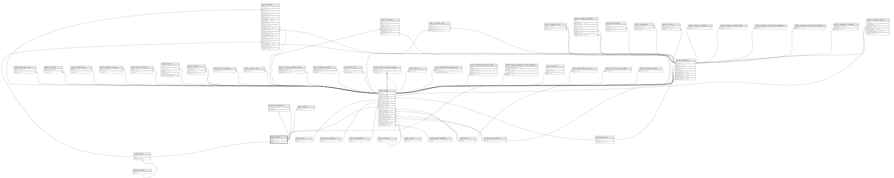

# public.cities

## Description

## Columns

| Name     | Type         | Default                            | Nullable | Children                                                                                                                                              | Parents                           |
| -------- | ------------ | ---------------------------------- | -------- | ----------------------------------------------------------------------------------------------------------------------------------------------------- | --------------------------------- |
| id       | bigint       | nextval('cities_id_seq'::regclass) | false    | [public.users](public.users.md) [public.companies](public.companies.md) [public.wards](public.wards.md) [public.psc_branches](public.psc_branches.md) |                                   |
| name     | varchar(255) |                                    | false    |                                                                                                                                                       |                                   |
| state_id | bigint       |                                    | false    |                                                                                                                                                       | [public.states](public.states.md) |

## Constraints

| Name                    | Type        | Definition                                                      |
| ----------------------- | ----------- | --------------------------------------------------------------- |
| cities_state_id_foreign | FOREIGN KEY | FOREIGN KEY (state_id) REFERENCES states(id) ON DELETE SET NULL |
| cities_pkey             | PRIMARY KEY | PRIMARY KEY (id)                                                |

## Indexes

| Name                       | Definition                                                                            |
| -------------------------- | ------------------------------------------------------------------------------------- |
| cities_pkey                | CREATE UNIQUE INDEX cities_pkey ON public.cities USING btree (id)                     |
| cities_state_id_name_index | CREATE INDEX cities_state_id_name_index ON public.cities USING btree (state_id, name) |

## Relations

---

> Generated by [tbls](https://github.com/k1LoW/tbls)
