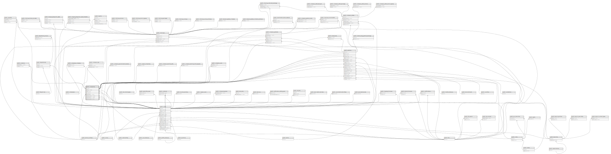

# public.companies

## Description

## Columns

| Name               | Type                           | Default                               | Nullable | Children                                                                                                                                                                                                                                                                                                                                                                                                                                                                                                                                                                                                                                                                                                                                          | Parents                                         |
| ------------------ | ------------------------------ | ------------------------------------- | -------- | ------------------------------------------------------------------------------------------------------------------------------------------------------------------------------------------------------------------------------------------------------------------------------------------------------------------------------------------------------------------------------------------------------------------------------------------------------------------------------------------------------------------------------------------------------------------------------------------------------------------------------------------------------------------------------------------------------------------------------------------------- | ----------------------------------------------- |
| id                 | bigint                         | nextval('companies_id_seq'::regclass) | false    | [public.departments](public.departments.md) [public.employees](public.employees.md) [public.patients](public.patients.md) [public.checkups](public.checkups.md) [public.contacts](public.contacts.md) [public.company_lots](public.company_lots.md) [public.copper_companies](public.copper_companies.md) [public.company_user](public.company_user.md) [public.company_patients](public.company_patients.md) [public.company_orders](public.company_orders.md) [public.company_banking_info](public.company_banking_info.md) [public.company_banking_info_requests](public.company_banking_info_requests.md) [public.company_payment_transactions](public.company_payment_transactions.md) [public.campaign_company](public.campaign_company.md) |                                                 |
| legal_name         | varchar(255)                   |                                       | true     |                                                                                                                                                                                                                                                                                                                                                                                                                                                                                                                                                                                                                                                                                                                                                   |                                                 |
| common_name        | varchar(255)                   |                                       | true     |                                                                                                                                                                                                                                                                                                                                                                                                                                                                                                                                                                                                                                                                                                                                                   |                                                 |
| tax_id             | varchar(255)                   |                                       | true     |                                                                                                                                                                                                                                                                                                                                                                                                                                                                                                                                                                                                                                                                                                                                                   |                                                 |
| email              | varchar(255)                   |                                       | true     |                                                                                                                                                                                                                                                                                                                                                                                                                                                                                                                                                                                                                                                                                                                                                   |                                                 |
| address            | varchar(255)                   |                                       | true     |                                                                                                                                                                                                                                                                                                                                                                                                                                                                                                                                                                                                                                                                                                                                                   |                                                 |
| branch_id          | integer                        |                                       | true     |                                                                                                                                                                                                                                                                                                                                                                                                                                                                                                                                                                                                                                                                                                                                                   | [public.branches](public.branches.md)           |
| logo_id            | bigint                         |                                       | true     |                                                                                                                                                                                                                                                                                                                                                                                                                                                                                                                                                                                                                                                                                                                                                   | [public.files](public.files.md)                 |
| city_id            | bigint                         |                                       | true     |                                                                                                                                                                                                                                                                                                                                                                                                                                                                                                                                                                                                                                                                                                                                                   | [public.cities](public.cities.md)               |
| phone_number_id    | bigint                         |                                       | true     |                                                                                                                                                                                                                                                                                                                                                                                                                                                                                                                                                                                                                                                                                                                                                   | [public.phone_numbers](public.phone_numbers.md) |
| created_by_user_id | integer                        |                                       | true     |                                                                                                                                                                                                                                                                                                                                                                                                                                                                                                                                                                                                                                                                                                                                                   | [public.users](public.users.md)                 |
| owned_by_user_id   | integer                        |                                       | true     |                                                                                                                                                                                                                                                                                                                                                                                                                                                                                                                                                                                                                                                                                                                                                   | [public.users](public.users.md)                 |
| created_at         | timestamp(0) without time zone |                                       | true     |                                                                                                                                                                                                                                                                                                                                                                                                                                                                                                                                                                                                                                                                                                                                                   |                                                 |
| updated_at         | timestamp(0) without time zone |                                       | true     |                                                                                                                                                                                                                                                                                                                                                                                                                                                                                                                                                                                                                                                                                                                                                   |                                                 |
| supervisor_user_id | bigint                         |                                       | true     |                                                                                                                                                                                                                                                                                                                                                                                                                                                                                                                                                                                                                                                                                                                                                   | [public.users](public.users.md)                 |
| status             | varchar(255)                   |                                       | true     |                                                                                                                                                                                                                                                                                                                                                                                                                                                                                                                                                                                                                                                                                                                                                   |                                                 |
| clinic_speciality  | varchar(255)                   |                                       | true     |                                                                                                                                                                                                                                                                                                                                                                                                                                                                                                                                                                                                                                                                                                                                                   |                                                 |
| medical_acc_type   | varchar(255)                   |                                       | true     |                                                                                                                                                                                                                                                                                                                                                                                                                                                                                                                                                                                                                                                                                                                                                   |                                                 |
| district           | varchar(255)                   |                                       | true     |                                                                                                                                                                                                                                                                                                                                                                                                                                                                                                                                                                                                                                                                                                                                                   |                                                 |
| payload            | json                           |                                       | true     |                                                                                                                                                                                                                                                                                                                                                                                                                                                                                                                                                                                                                                                                                                                                                   |                                                 |
| city_name          | varchar(255)                   |                                       | true     |                                                                                                                                                                                                                                                                                                                                                                                                                                                                                                                                                                                                                                                                                                                                                   |                                                 |
| province           | varchar(255)                   |                                       | true     |                                                                                                                                                                                                                                                                                                                                                                                                                                                                                                                                                                                                                                                                                                                                                   |                                                 |

## Constraints

| Name                                 | Type        | Definition                                                                    |
| ------------------------------------ | ----------- | ----------------------------------------------------------------------------- |
| companies_branch_id_foreign          | FOREIGN KEY | FOREIGN KEY (branch_id) REFERENCES branches(id) ON DELETE CASCADE             |
| companies_created_by_user_id_foreign | FOREIGN KEY | FOREIGN KEY (created_by_user_id) REFERENCES users(id) ON DELETE SET NULL      |
| companies_owned_by_user_id_foreign   | FOREIGN KEY | FOREIGN KEY (owned_by_user_id) REFERENCES users(id) ON DELETE SET NULL        |
| companies_supervisor_user_id_foreign | FOREIGN KEY | FOREIGN KEY (supervisor_user_id) REFERENCES users(id) ON DELETE CASCADE       |
| companies_city_id_foreign            | FOREIGN KEY | FOREIGN KEY (city_id) REFERENCES cities(id) ON DELETE SET NULL                |
| companies_logo_id_foreign            | FOREIGN KEY | FOREIGN KEY (logo_id) REFERENCES files(id) ON DELETE SET NULL                 |
| companies_phone_number_id_foreign    | FOREIGN KEY | FOREIGN KEY (phone_number_id) REFERENCES phone_numbers(id) ON DELETE SET NULL |
| companies_pkey                       | PRIMARY KEY | PRIMARY KEY (id)                                                              |

## Indexes

| Name                               | Definition                                                                                           |
| ---------------------------------- | ---------------------------------------------------------------------------------------------------- |
| companies_pkey                     | CREATE UNIQUE INDEX companies_pkey ON public.companies USING btree (id)                              |
| companies_owned_by_user_id_index   | CREATE INDEX companies_owned_by_user_id_index ON public.companies USING btree (owned_by_user_id)     |
| companies_supervisor_user_id_index | CREATE INDEX companies_supervisor_user_id_index ON public.companies USING btree (supervisor_user_id) |

## Relations

---

> Generated by [tbls](https://github.com/k1LoW/tbls)
