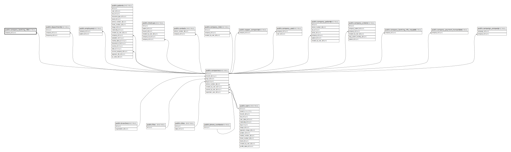

# public.company_banking_info

## Description

## Columns

| Name           | Type                           | Default                                          | Nullable | Parents                                 |
| -------------- | ------------------------------ | ------------------------------------------------ | -------- | --------------------------------------- |
| id             | bigint                         | nextval('company_banking_info_id_seq'::regclass) | false    |                                         |
| company_id     | bigint                         |                                                  | false    | [public.companies](public.companies.md) |
| full_name      | varchar(255)                   |                                                  | false    |                                         |
| bank_name      | varchar(255)                   |                                                  | false    |                                         |
| bank_code      | varchar(255)                   |                                                  | true     |                                         |
| account_number | varchar(255)                   |                                                  | false    |                                         |
| created_at     | timestamp(0) without time zone |                                                  | true     |                                         |
| updated_at     | timestamp(0) without time zone |                                                  | true     |                                         |

## Constraints

| Name                                    | Type        | Definition                                                           |
| --------------------------------------- | ----------- | -------------------------------------------------------------------- |
| company_banking_info_company_id_foreign | FOREIGN KEY | FOREIGN KEY (company_id) REFERENCES companies(id) ON DELETE SET NULL |
| company_banking_info_pkey               | PRIMARY KEY | PRIMARY KEY (id)                                                     |
| company_banking_info_company_id_unique  | UNIQUE      | UNIQUE (company_id)                                                  |

## Indexes

| Name                                   | Definition                                                                                                         |
| -------------------------------------- | ------------------------------------------------------------------------------------------------------------------ |
| company_banking_info_pkey              | CREATE UNIQUE INDEX company_banking_info_pkey ON public.company_banking_info USING btree (id)                      |
| company_banking_info_company_id_unique | CREATE UNIQUE INDEX company_banking_info_company_id_unique ON public.company_banking_info USING btree (company_id) |

## Relations

---

> Generated by [tbls](https://github.com/k1LoW/tbls)
