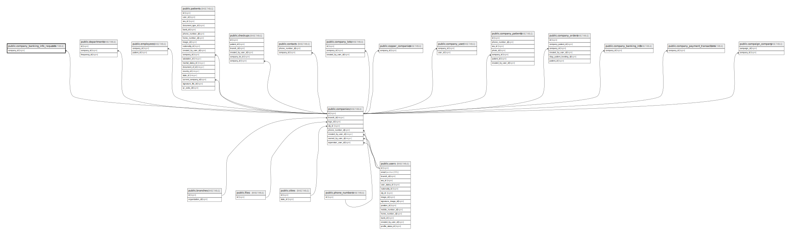

# public.company_banking_info_requests

## Description

## Columns

| Name           | Type                           | Default                                                   | Nullable | Parents                                 |
| -------------- | ------------------------------ | --------------------------------------------------------- | -------- | --------------------------------------- |
| id             | bigint                         | nextval('company_banking_info_requests_id_seq'::regclass) | false    |                                         |
| company_id     | bigint                         |                                                           | false    | [public.companies](public.companies.md) |
| full_name      | varchar(255)                   |                                                           | false    |                                         |
| bank_name      | varchar(255)                   |                                                           | false    |                                         |
| bank_code      | varchar(255)                   |                                                           | false    |                                         |
| account_number | varchar(255)                   |                                                           | false    |                                         |
| status         | varchar(255)                   | 'pending'::character varying                              | false    |                                         |
| created_at     | timestamp(0) without time zone |                                                           | true     |                                         |
| updated_at     | timestamp(0) without time zone |                                                           | true     |                                         |

## Constraints

| Name                                             | Type        | Definition                                                           |
| ------------------------------------------------ | ----------- | -------------------------------------------------------------------- |
| company_banking_info_requests_company_id_foreign | FOREIGN KEY | FOREIGN KEY (company_id) REFERENCES companies(id) ON DELETE SET NULL |
| company_banking_info_requests_pkey               | PRIMARY KEY | PRIMARY KEY (id)                                                     |

## Indexes

| Name                               | Definition                                                                                                      |
| ---------------------------------- | --------------------------------------------------------------------------------------------------------------- |
| company_banking_info_requests_pkey | CREATE UNIQUE INDEX company_banking_info_requests_pkey ON public.company_banking_info_requests USING btree (id) |

## Relations

---

> Generated by [tbls](https://github.com/k1LoW/tbls)
