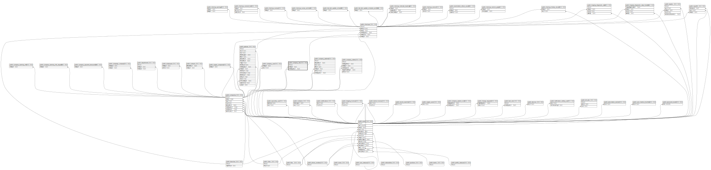

# public.company_lots

## Description

## Columns

| Name               | Type                           | Default                                  | Nullable | Children                              | Parents                                 |
| ------------------ | ------------------------------ | ---------------------------------------- | -------- | ------------------------------------- | --------------------------------------- |
| id                 | bigint                         | nextval('company_lots_id_seq'::regclass) | false    | [public.checkups](public.checkups.md) |                                         |
| name               | varchar(255)                   |                                          | false    |                                       |                                         |
| company_id         | bigint                         |                                          | false    |                                       | [public.companies](public.companies.md) |
| created_by_user_id | bigint                         |                                          | true     |                                       | [public.users](public.users.md)         |
| activated_at       | timestamp(0) without time zone |                                          | true     |                                       |                                         |
| created_at         | timestamp(0) without time zone |                                          | true     |                                       |                                         |
| updated_at         | timestamp(0) without time zone |                                          | true     |                                       |                                         |

## Constraints

| Name                                    | Type        | Definition                                                               |
| --------------------------------------- | ----------- | ------------------------------------------------------------------------ |
| company_lots_created_by_user_id_foreign | FOREIGN KEY | FOREIGN KEY (created_by_user_id) REFERENCES users(id) ON DELETE SET NULL |
| company_lots_company_id_foreign         | FOREIGN KEY | FOREIGN KEY (company_id) REFERENCES companies(id) ON DELETE CASCADE      |
| company_lots_pkey                       | PRIMARY KEY | PRIMARY KEY (id)                                                         |

## Indexes

| Name              | Definition                                                                    |
| ----------------- | ----------------------------------------------------------------------------- |
| company_lots_pkey | CREATE UNIQUE INDEX company_lots_pkey ON public.company_lots USING btree (id) |

## Relations

---

> Generated by [tbls](https://github.com/k1LoW/tbls)
