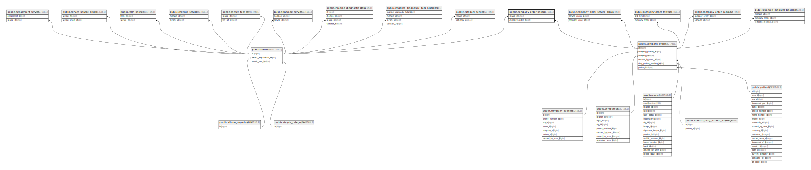

# public.company_order_service

## Description

## Columns

| Name             | Type                           | Default                                           | Nullable | Parents                                           |
| ---------------- | ------------------------------ | ------------------------------------------------- | -------- | ------------------------------------------------- |
| id               | bigint                         | nextval('company_order_service_id_seq'::regclass) | false    |                                                   |
| service_id       | bigint                         |                                                   | false    | [public.services](public.services.md)             |
| company_order_id | bigint                         |                                                   | false    | [public.company_orders](public.company_orders.md) |
| created_at       | timestamp(0) without time zone |                                                   | true     |                                                   |
| updated_at       | timestamp(0) without time zone |                                                   | true     |                                                   |

## Constraints

| Name                                           | Type        | Definition                                                                     |
| ---------------------------------------------- | ----------- | ------------------------------------------------------------------------------ |
| company_order_service_service_id_foreign       | FOREIGN KEY | FOREIGN KEY (service_id) REFERENCES services(id) ON DELETE CASCADE             |
| company_order_service_company_order_id_foreign | FOREIGN KEY | FOREIGN KEY (company_order_id) REFERENCES company_orders(id) ON DELETE CASCADE |
| company_order_service_pkey                     | PRIMARY KEY | PRIMARY KEY (id)                                                               |

## Indexes

| Name                                         | Definition                                                                                                               |
| -------------------------------------------- | ------------------------------------------------------------------------------------------------------------------------ |
| company_order_service_pkey                   | CREATE UNIQUE INDEX company_order_service_pkey ON public.company_order_service USING btree (id)                          |
| company_order_service_service_id_index       | CREATE INDEX company_order_service_service_id_index ON public.company_order_service USING btree (service_id)             |
| company_order_service_company_order_id_index | CREATE INDEX company_order_service_company_order_id_index ON public.company_order_service USING btree (company_order_id) |

## Relations

---

> Generated by [tbls](https://github.com/k1LoW/tbls)
