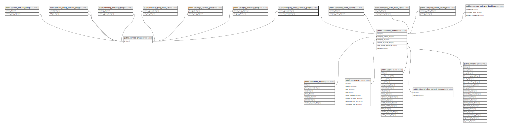

# public.company_order_service_group

## Description

## Columns

| Name             | Type                           | Default                                                 | Nullable | Parents                                           |
| ---------------- | ------------------------------ | ------------------------------------------------------- | -------- | ------------------------------------------------- |
| id               | bigint                         | nextval('company_order_service_group_id_seq'::regclass) | false    |                                                   |
| service_group_id | bigint                         |                                                         | false    | [public.service_groups](public.service_groups.md) |
| company_order_id | bigint                         |                                                         | false    | [public.company_orders](public.company_orders.md) |
| created_at       | timestamp(0) without time zone |                                                         | true     |                                                   |
| updated_at       | timestamp(0) without time zone |                                                         | true     |                                                   |

## Constraints

| Name                                                 | Type        | Definition                                                                     |
| ---------------------------------------------------- | ----------- | ------------------------------------------------------------------------------ |
| company_order_service_group_service_group_id_foreign | FOREIGN KEY | FOREIGN KEY (service_group_id) REFERENCES service_groups(id) ON DELETE CASCADE |
| company_order_service_group_company_order_id_foreign | FOREIGN KEY | FOREIGN KEY (company_order_id) REFERENCES company_orders(id) ON DELETE CASCADE |
| company_order_service_group_pkey                     | PRIMARY KEY | PRIMARY KEY (id)                                                               |

## Indexes

| Name                                               | Definition                                                                                                                           |
| -------------------------------------------------- | ------------------------------------------------------------------------------------------------------------------------------------ |
| company_order_service_group_pkey                   | CREATE UNIQUE INDEX company_order_service_group_pkey ON public.company_order_service_group USING btree (id)                          |
| company_order_service_group_service_group_id_index | CREATE INDEX company_order_service_group_service_group_id_index ON public.company_order_service_group USING btree (service_group_id) |
| company_order_service_group_company_order_id_index | CREATE INDEX company_order_service_group_company_order_id_index ON public.company_order_service_group USING btree (company_order_id) |

## Relations

---

> Generated by [tbls](https://github.com/k1LoW/tbls)
