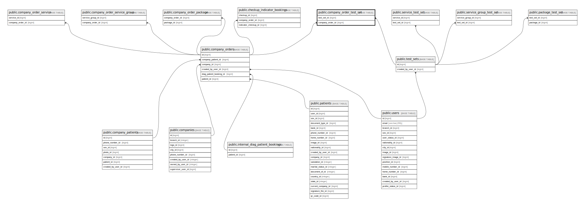

# public.company_order_test_set

## Description

## Columns

| Name             | Type                           | Default                                            | Nullable | Parents                                           |
| ---------------- | ------------------------------ | -------------------------------------------------- | -------- | ------------------------------------------------- |
| id               | bigint                         | nextval('company_order_test_set_id_seq'::regclass) | false    |                                                   |
| test_set_id      | bigint                         |                                                    | false    | [public.test_sets](public.test_sets.md)           |
| company_order_id | bigint                         |                                                    | false    | [public.company_orders](public.company_orders.md) |
| created_at       | timestamp(0) without time zone |                                                    | true     |                                                   |
| updated_at       | timestamp(0) without time zone |                                                    | true     |                                                   |

## Constraints

| Name                                            | Type        | Definition                                                                     |
| ----------------------------------------------- | ----------- | ------------------------------------------------------------------------------ |
| company_order_test_set_test_set_id_foreign      | FOREIGN KEY | FOREIGN KEY (test_set_id) REFERENCES test_sets(id) ON DELETE CASCADE           |
| company_order_test_set_company_order_id_foreign | FOREIGN KEY | FOREIGN KEY (company_order_id) REFERENCES company_orders(id) ON DELETE CASCADE |
| company_order_test_set_pkey                     | PRIMARY KEY | PRIMARY KEY (id)                                                               |

## Indexes

| Name                                          | Definition                                                                                                                 |
| --------------------------------------------- | -------------------------------------------------------------------------------------------------------------------------- |
| company_order_test_set_pkey                   | CREATE UNIQUE INDEX company_order_test_set_pkey ON public.company_order_test_set USING btree (id)                          |
| company_order_test_set_test_set_id_index      | CREATE INDEX company_order_test_set_test_set_id_index ON public.company_order_test_set USING btree (test_set_id)           |
| company_order_test_set_company_order_id_index | CREATE INDEX company_order_test_set_company_order_id_index ON public.company_order_test_set USING btree (company_order_id) |

## Relations

---

> Generated by [tbls](https://github.com/k1LoW/tbls)
