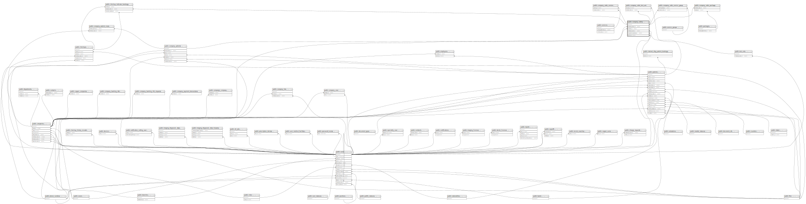

# public.company_orders

## Description

## Columns

| Name                    | Type                           | Default                                    | Nullable | Children                                                                                                                                                                                                                                                                                                                                                | Parents                                                                           |
| ----------------------- | ------------------------------ | ------------------------------------------ | -------- | ------------------------------------------------------------------------------------------------------------------------------------------------------------------------------------------------------------------------------------------------------------------------------------------------------------------------------------------------------- | --------------------------------------------------------------------------------- |
| id                      | bigint                         | nextval('company_orders_id_seq'::regclass) | false    | [public.company_order_service](public.company_order_service.md) [public.company_order_service_group](public.company_order_service_group.md) [public.company_order_test_set](public.company_order_test_set.md) [public.company_order_package](public.company_order_package.md) [public.checkup_indicator_bookings](public.checkup_indicator_bookings.md) |                                                                                   |
| company_patient_id      | bigint                         |                                            | true     |                                                                                                                                                                                                                                                                                                                                                         | [public.company_patients](public.company_patients.md)                             |
| note                    | text                           |                                            | true     |                                                                                                                                                                                                                                                                                                                                                         |                                                                                   |
| company_id              | bigint                         |                                            | true     |                                                                                                                                                                                                                                                                                                                                                         | [public.companies](public.companies.md)                                           |
| created_by_user_id      | bigint                         |                                            | true     |                                                                                                                                                                                                                                                                                                                                                         | [public.users](public.users.md)                                                   |
| created_at              | timestamp(0) without time zone |                                            | true     |                                                                                                                                                                                                                                                                                                                                                         |                                                                                   |
| updated_at              | timestamp(0) without time zone |                                            | true     |                                                                                                                                                                                                                                                                                                                                                         |                                                                                   |
| order_type              | varchar(255)                   | 'service'::character varying               | false    |                                                                                                                                                                                                                                                                                                                                                         |                                                                                   |
| metadata                | json                           |                                            | true     |                                                                                                                                                                                                                                                                                                                                                         |                                                                                   |
| deleted_at              | timestamp(0) without time zone |                                            | true     |                                                                                                                                                                                                                                                                                                                                                         |                                                                                   |
| reference_code          | varchar(255)                   |                                            | true     |                                                                                                                                                                                                                                                                                                                                                         |                                                                                   |
| status                  | varchar(255)                   | 'pending'::character varying               | true     |                                                                                                                                                                                                                                                                                                                                                         |                                                                                   |
| source_type             | varchar(255)                   |                                            | true     |                                                                                                                                                                                                                                                                                                                                                         |                                                                                   |
| diag_patient_booking_id | bigint                         |                                            | true     |                                                                                                                                                                                                                                                                                                                                                         | [public.internal_diag_patient_bookings](public.internal_diag_patient_bookings.md) |
| patient_id              | bigint                         |                                            | true     |                                                                                                                                                                                                                                                                                                                                                         | [public.patients](public.patients.md)                                             |
| booking_created_by      | varchar(255)                   |                                            | true     |                                                                                                                                                                                                                                                                                                                                                         |                                                                                   |
| internal_note           | text                           |                                            | true     |                                                                                                                                                                                                                                                                                                                                                         |                                                                                   |
| booking_created_owner   | varchar(255)                   |                                            | true     |                                                                                                                                                                                                                                                                                                                                                         |                                                                                   |

## Constraints

| Name                                           | Type        | Definition                                                                          |
| ---------------------------------------------- | ----------- | ----------------------------------------------------------------------------------- |
| company_orders_created_by_user_id_foreign      | FOREIGN KEY | FOREIGN KEY (created_by_user_id) REFERENCES users(id) ON DELETE SET NULL            |
| company_orders_company_id_foreign              | FOREIGN KEY | FOREIGN KEY (company_id) REFERENCES companies(id) ON DELETE CASCADE                 |
| company_orders_patient_id_foreign              | FOREIGN KEY | FOREIGN KEY (patient_id) REFERENCES patients(id)                                    |
| company_orders_company_patient_id_foreign      | FOREIGN KEY | FOREIGN KEY (company_patient_id) REFERENCES company_patients(id) ON DELETE SET NULL |
| company_orders_pkey                            | PRIMARY KEY | PRIMARY KEY (id)                                                                    |
| unique_company_orders_reference_code           | UNIQUE      | UNIQUE (reference_code)                                                             |
| company_orders_diag_patient_booking_id_foreign | FOREIGN KEY | FOREIGN KEY (diag_patient_booking_id) REFERENCES internal_diag_patient_bookings(id) |

## Indexes

| Name                                              | Definition                                                                                                                                                                     |
| ------------------------------------------------- | ------------------------------------------------------------------------------------------------------------------------------------------------------------------------------ |
| company_orders_pkey                               | CREATE UNIQUE INDEX company_orders_pkey ON public.company_orders USING btree (id)                                                                                              |
| unique_company_orders_reference_code              | CREATE UNIQUE INDEX unique_company_orders_reference_code ON public.company_orders USING btree (reference_code)                                                                 |
| idx_company_orders_company_id                     | CREATE INDEX idx_company_orders_company_id ON public.company_orders USING btree (company_id)                                                                                   |
| idx_company_orders_deleted_at                     | CREATE INDEX idx_company_orders_deleted_at ON public.company_orders USING btree (deleted_at)                                                                                   |
| index_company_orders_on_company_id_and_created_at | CREATE INDEX index_company_orders_on_company_id_and_created_at ON public.company_orders USING btree (company_id, created_at) WITH (fillfactor='70') WHERE (deleted_at IS NULL) |
| idx_company_orders_created_at                     | CREATE INDEX idx_company_orders_created_at ON public.company_orders USING btree (created_at)                                                                                   |

## Relations

---

> Generated by [tbls](https://github.com/k1LoW/tbls)
