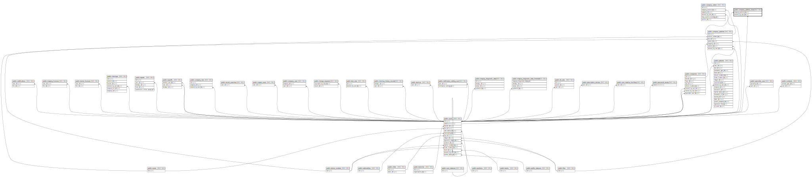

# public.company_patient_visits

## Description

## Columns

| Name               | Type                           | Default                                            | Nullable | Parents                                               |
| ------------------ | ------------------------------ | -------------------------------------------------- | -------- | ----------------------------------------------------- |
| id                 | bigint                         | nextval('company_patient_visits_id_seq'::regclass) | false    |                                                       |
| date               | timestamp(0) without time zone |                                                    | false    |                                                       |
| revisit_date       | timestamp(0) without time zone |                                                    | true     |                                                       |
| note               | text                           |                                                    | true     |                                                       |
| company_patient_id | bigint                         |                                                    | false    | [public.company_patients](public.company_patients.md) |
| created_by_user_id | bigint                         |                                                    | true     | [public.users](public.users.md)                       |
| created_at         | timestamp(0) without time zone |                                                    | true     |                                                       |
| updated_at         | timestamp(0) without time zone |                                                    | true     |                                                       |
| deleted_at         | timestamp(0) without time zone |                                                    | true     |                                                       |

## Constraints

| Name                                              | Type        | Definition                                                                         |
| ------------------------------------------------- | ----------- | ---------------------------------------------------------------------------------- |
| company_patient_visits_created_by_user_id_foreign | FOREIGN KEY | FOREIGN KEY (created_by_user_id) REFERENCES users(id) ON DELETE SET NULL           |
| company_patient_visits_company_patient_id_foreign | FOREIGN KEY | FOREIGN KEY (company_patient_id) REFERENCES company_patients(id) ON DELETE CASCADE |
| company_patient_visits_pkey                       | PRIMARY KEY | PRIMARY KEY (id)                                                                   |

## Indexes

| Name                        | Definition                                                                                        |
| --------------------------- | ------------------------------------------------------------------------------------------------- |
| company_patient_visits_pkey | CREATE UNIQUE INDEX company_patient_visits_pkey ON public.company_patient_visits USING btree (id) |

## Relations

---

> Generated by [tbls](https://github.com/k1LoW/tbls)
