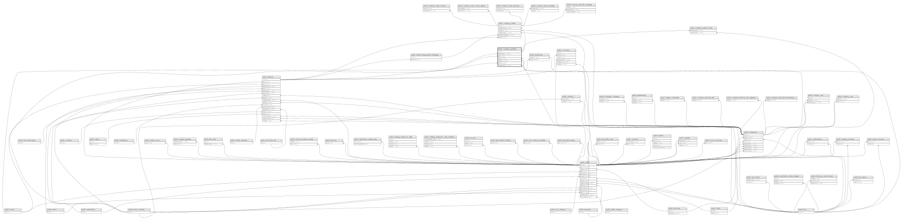

# public.company_patients

## Description

## Columns

| Name               | Type                           | Default                                      | Nullable | Children                                                                                                            | Parents                                         |
| ------------------ | ------------------------------ | -------------------------------------------- | -------- | ------------------------------------------------------------------------------------------------------------------- | ----------------------------------------------- |
| id                 | bigint                         | nextval('company_patients_id_seq'::regclass) | false    | [public.company_patient_visits](public.company_patient_visits.md) [public.company_orders](public.company_orders.md) |                                                 |
| first_name         | varchar(255)                   |                                              | true     |                                                                                                                     |                                                 |
| middle_name        | varchar(255)                   |                                              | true     |                                                                                                                     |                                                 |
| family_name        | varchar(255)                   |                                              | true     |                                                                                                                     |                                                 |
| date_of_birth      | timestamp(0) without time zone |                                              | true     |                                                                                                                     |                                                 |
| note               | text                           |                                              | true     |                                                                                                                     |                                                 |
| email              | varchar(255)                   |                                              | true     |                                                                                                                     |                                                 |
| phone_number_id    | bigint                         |                                              | true     |                                                                                                                     | [public.phone_numbers](public.phone_numbers.md) |
| sex_id             | bigint                         |                                              | true     |                                                                                                                     | [public.sexes](public.sexes.md)                 |
| photo_id           | bigint                         |                                              | true     |                                                                                                                     | [public.files](public.files.md)                 |
| company_id         | bigint                         |                                              | true     |                                                                                                                     | [public.companies](public.companies.md)         |
| patient_id         | bigint                         |                                              | true     |                                                                                                                     | [public.patients](public.patients.md)           |
| created_by_user_id | bigint                         |                                              | true     |                                                                                                                     | [public.users](public.users.md)                 |
| created_at         | timestamp(0) without time zone |                                              | true     |                                                                                                                     |                                                 |
| updated_at         | timestamp(0) without time zone |                                              | true     |                                                                                                                     |                                                 |
| deleted_at         | timestamp(0) without time zone |                                              | true     |                                                                                                                     |                                                 |
| address            | varchar(255)                   |                                              | true     |                                                                                                                     |                                                 |
| city               | varchar(255)                   |                                              | true     |                                                                                                                     |                                                 |
| full_name          | varchar(255)                   |                                              | true     |                                                                                                                     |                                                 |
| metadata           | json                           |                                              | true     |                                                                                                                     |                                                 |

## Constraints

| Name                                        | Type        | Definition                                                                    |
| ------------------------------------------- | ----------- | ----------------------------------------------------------------------------- |
| company_patients_created_by_user_id_foreign | FOREIGN KEY | FOREIGN KEY (created_by_user_id) REFERENCES users(id) ON DELETE SET NULL      |
| company_patients_sex_id_foreign             | FOREIGN KEY | FOREIGN KEY (sex_id) REFERENCES sexes(id) ON DELETE SET NULL                  |
| company_patients_photo_id_foreign           | FOREIGN KEY | FOREIGN KEY (photo_id) REFERENCES files(id) ON DELETE SET NULL                |
| company_patients_phone_number_id_foreign    | FOREIGN KEY | FOREIGN KEY (phone_number_id) REFERENCES phone_numbers(id) ON DELETE SET NULL |
| company_patients_company_id_foreign         | FOREIGN KEY | FOREIGN KEY (company_id) REFERENCES companies(id) ON DELETE CASCADE           |
| company_patients_patient_id_foreign         | FOREIGN KEY | FOREIGN KEY (patient_id) REFERENCES patients(id) ON DELETE CASCADE            |
| company_patients_pkey                       | PRIMARY KEY | PRIMARY KEY (id)                                                              |

## Indexes

| Name                                      | Definition                                                                                                         |
| ----------------------------------------- | ------------------------------------------------------------------------------------------------------------------ |
| company_patients_pkey                     | CREATE UNIQUE INDEX company_patients_pkey ON public.company_patients USING btree (id)                              |
| company_patients_company_id_index         | CREATE INDEX company_patients_company_id_index ON public.company_patients USING btree (company_id)                 |
| company_patients_patient_id_index         | CREATE INDEX company_patients_patient_id_index ON public.company_patients USING btree (patient_id)                 |
| company_patients_phone_number_id_index    | CREATE INDEX company_patients_phone_number_id_index ON public.company_patients USING btree (phone_number_id)       |
| company_patients_created_by_user_id_index | CREATE INDEX company_patients_created_by_user_id_index ON public.company_patients USING btree (created_by_user_id) |

## Relations

---

> Generated by [tbls](https://github.com/k1LoW/tbls)
