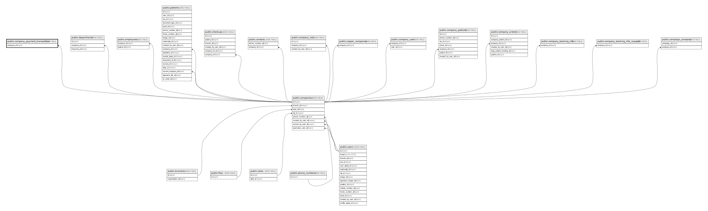

# public.company_payment_transactions

## Description

## Columns

| Name            | Type                           | Default                                                  | Nullable | Parents                                 |
| --------------- | ------------------------------ | -------------------------------------------------------- | -------- | --------------------------------------- |
| id              | bigint                         | nextval('company_payment_transactions_id_seq'::regclass) | false    |                                         |
| company_id      | bigint                         |                                                          | false    | [public.companies](public.companies.md) |
| total_revenue   | numeric(150,2)                 | '0'::numeric                                             | false    |                                         |
| received_amount | numeric(150,2)                 |                                                          | true     |                                         |
| status          | varchar(255)                   | 'pending'::character varying                             | false    |                                         |
| period_month    | date                           |                                                          | false    |                                         |
| created_at      | timestamp(0) without time zone |                                                          | true     |                                         |
| updated_at      | timestamp(0) without time zone |                                                          | true     |                                         |

## Constraints

| Name                                            | Type        | Definition                                                           |
| ----------------------------------------------- | ----------- | -------------------------------------------------------------------- |
| company_payment_transactions_company_id_foreign | FOREIGN KEY | FOREIGN KEY (company_id) REFERENCES companies(id) ON DELETE SET NULL |
| company_payment_transactions_pkey               | PRIMARY KEY | PRIMARY KEY (id)                                                     |

## Indexes

| Name                              | Definition                                                                                                    |
| --------------------------------- | ------------------------------------------------------------------------------------------------------------- |
| company_payment_transactions_pkey | CREATE UNIQUE INDEX company_payment_transactions_pkey ON public.company_payment_transactions USING btree (id) |

## Relations

---

> Generated by [tbls](https://github.com/k1LoW/tbls)
