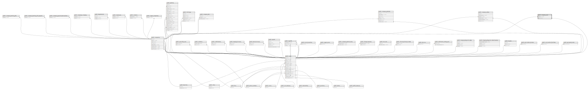

# public.company_user

## Description

## Columns

| Name       | Type                           | Default                                   | Nullable | Parents                                 |
| ---------- | ------------------------------ | ----------------------------------------- | -------- | --------------------------------------- |
| id         | bigint                         | nextval('company_users_id_seq'::regclass) | false    |                                         |
| created_at | timestamp(0) without time zone |                                           | true     |                                         |
| updated_at | timestamp(0) without time zone |                                           | true     |                                         |
| company_id | bigint                         |                                           | false    | [public.companies](public.companies.md) |
| user_id    | bigint                         |                                           | false    | [public.users](public.users.md)         |

## Constraints

| Name                             | Type        | Definition                                                          |
| -------------------------------- | ----------- | ------------------------------------------------------------------- |
| company_users_user_id_foreign    | FOREIGN KEY | FOREIGN KEY (user_id) REFERENCES users(id) ON DELETE CASCADE        |
| company_users_company_id_foreign | FOREIGN KEY | FOREIGN KEY (company_id) REFERENCES companies(id) ON DELETE CASCADE |
| company_users_pkey               | PRIMARY KEY | PRIMARY KEY (id)                                                    |

## Indexes

| Name                          | Definition                                                                                 |
| ----------------------------- | ------------------------------------------------------------------------------------------ |
| company_users_pkey            | CREATE UNIQUE INDEX company_users_pkey ON public.company_user USING btree (id)             |
| company_user_company_id_index | CREATE INDEX company_user_company_id_index ON public.company_user USING btree (company_id) |
| company_user_user_id_index    | CREATE INDEX company_user_user_id_index ON public.company_user USING btree (user_id)       |

## Relations

---

> Generated by [tbls](https://github.com/k1LoW/tbls)
