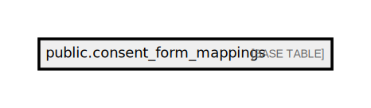

# public.consent_form_mappings

## Description

## Columns

| Name                    | Type                           | Default                                           | Nullable |
| ----------------------- | ------------------------------ | ------------------------------------------------- | -------- |
| id                      | bigint                         | nextval('consent_form_mappings_id_seq'::regclass) | false    |
| created_at              | timestamp(0) without time zone |                                                   | true     |
| updated_at              | timestamp(0) without time zone |                                                   | true     |
| form_number             | varchar(255)                   |                                                   | false    |
| gender                  | varchar(255)                   |                                                   | true     |
| attune_investigation_id | varchar(255)                   |                                                   | false    |

## Constraints

| Name                       | Type        | Definition       |
| -------------------------- | ----------- | ---------------- |
| consent_form_mappings_pkey | PRIMARY KEY | PRIMARY KEY (id) |

## Indexes

| Name                       | Definition                                                                                      |
| -------------------------- | ----------------------------------------------------------------------------------------------- |
| consent_form_mappings_pkey | CREATE UNIQUE INDEX consent_form_mappings_pkey ON public.consent_form_mappings USING btree (id) |

## Relations

---

> Generated by [tbls](https://github.com/k1LoW/tbls)
