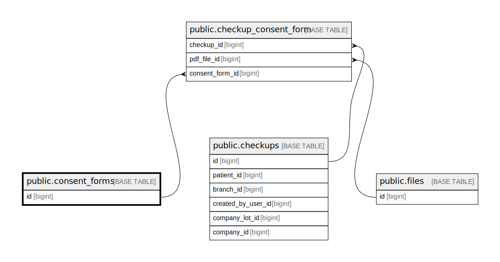

# public.consent_forms

## Description

## Columns

| Name        | Type                           | Default                                   | Nullable | Children                                                      |
| ----------- | ------------------------------ | ----------------------------------------- | -------- | ------------------------------------------------------------- |
| id          | bigint                         | nextval('consent_forms_id_seq'::regclass) | false    | [public.checkup_consent_form](public.checkup_consent_form.md) |
| code        | varchar(255)                   |                                           | false    |                                                               |
| title       | varchar(255)                   |                                           | false    |                                                               |
| description | text                           |                                           | true     |                                                               |
| created_at  | timestamp(0) without time zone |                                           | true     |                                                               |
| updated_at  | timestamp(0) without time zone |                                           | true     |                                                               |

## Constraints

| Name               | Type        | Definition       |
| ------------------ | ----------- | ---------------- |
| consent_forms_pkey | PRIMARY KEY | PRIMARY KEY (id) |

## Indexes

| Name               | Definition                                                                      |
| ------------------ | ------------------------------------------------------------------------------- |
| consent_forms_pkey | CREATE UNIQUE INDEX consent_forms_pkey ON public.consent_forms USING btree (id) |

## Relations

---

> Generated by [tbls](https://github.com/k1LoW/tbls)
