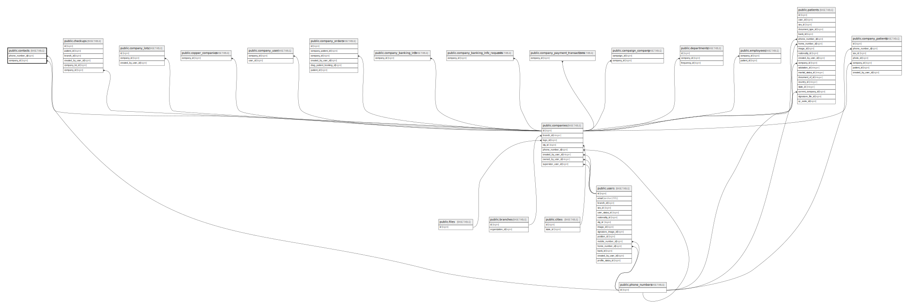

# public.contacts

## Description

## Columns

| Name            | Type                           | Default                              | Nullable | Parents                                         |
| --------------- | ------------------------------ | ------------------------------------ | -------- | ----------------------------------------------- |
| id              | bigint                         | nextval('contacts_id_seq'::regclass) | false    |                                                 |
| email           | varchar(255)                   |                                      | false    |                                                 |
| name            | varchar(255)                   |                                      | false    |                                                 |
| position        | varchar(255)                   |                                      | false    |                                                 |
| phone_number_id | bigint                         |                                      | true     | [public.phone_numbers](public.phone_numbers.md) |
| company_id      | bigint                         |                                      | false    | [public.companies](public.companies.md)         |
| created_at      | timestamp(0) without time zone |                                      | true     |                                                 |
| updated_at      | timestamp(0) without time zone |                                      | true     |                                                 |

## Constraints

| Name                             | Type        | Definition                                                                    |
| -------------------------------- | ----------- | ----------------------------------------------------------------------------- |
| contacts_phone_number_id_foreign | FOREIGN KEY | FOREIGN KEY (phone_number_id) REFERENCES phone_numbers(id) ON DELETE SET NULL |
| contacts_company_id_foreign      | FOREIGN KEY | FOREIGN KEY (company_id) REFERENCES companies(id) ON DELETE CASCADE           |
| contacts_pkey                    | PRIMARY KEY | PRIMARY KEY (id)                                                              |

## Indexes

| Name          | Definition                                                            |
| ------------- | --------------------------------------------------------------------- |
| contacts_pkey | CREATE UNIQUE INDEX contacts_pkey ON public.contacts USING btree (id) |

## Relations

---

> Generated by [tbls](https://github.com/k1LoW/tbls)
