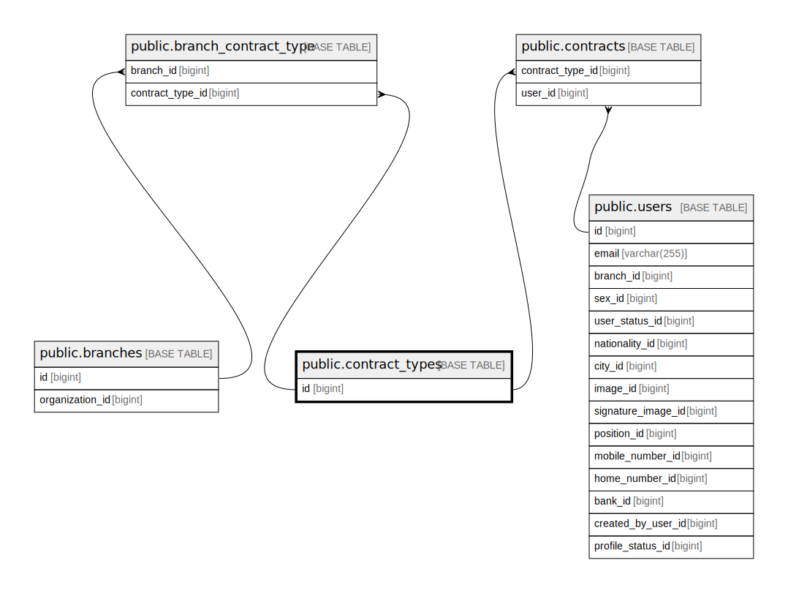

# public.contract_types

## Description

## Columns

| Name | Type         | Default                                    | Nullable | Children                                                                                              |
| ---- | ------------ | ------------------------------------------ | -------- | ----------------------------------------------------------------------------------------------------- |
| id   | bigint       | nextval('contract_types_id_seq'::regclass) | false    | [public.branch_contract_type](public.branch_contract_type.md) [public.contracts](public.contracts.md) |
| slug | varchar(255) |                                            | false    |                                                                                                       |
| name | varchar(255) |                                            | false    |                                                                                                       |

## Constraints

| Name                       | Type        | Definition       |
| -------------------------- | ----------- | ---------------- |
| contract_types_pkey        | PRIMARY KEY | PRIMARY KEY (id) |
| contract_types_slug_unique | UNIQUE      | UNIQUE (slug)    |

## Indexes

| Name                       | Definition                                                                                 |
| -------------------------- | ------------------------------------------------------------------------------------------ |
| contract_types_pkey        | CREATE UNIQUE INDEX contract_types_pkey ON public.contract_types USING btree (id)          |
| contract_types_slug_unique | CREATE UNIQUE INDEX contract_types_slug_unique ON public.contract_types USING btree (slug) |

## Relations

---

> Generated by [tbls](https://github.com/k1LoW/tbls)
