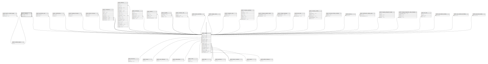

# public.contracts

## Description

## Columns

| Name             | Type                           | Default                               | Nullable | Parents                                           |
| ---------------- | ------------------------------ | ------------------------------------- | -------- | ------------------------------------------------- |
| id               | bigint                         | nextval('contracts_id_seq'::regclass) | false    |                                                   |
| start            | timestamp(0) without time zone |                                       | false    |                                                   |
| end              | timestamp(0) without time zone |                                       | false    |                                                   |
| contract_type_id | bigint                         |                                       | false    | [public.contract_types](public.contract_types.md) |
| user_id          | bigint                         |                                       | false    | [public.users](public.users.md)                   |
| created_at       | timestamp(0) without time zone |                                       | true     |                                                   |
| updated_at       | timestamp(0) without time zone |                                       | true     |                                                   |

## Constraints

| Name                               | Type        | Definition                                                                     |
| ---------------------------------- | ----------- | ------------------------------------------------------------------------------ |
| contracts_user_id_foreign          | FOREIGN KEY | FOREIGN KEY (user_id) REFERENCES users(id) ON DELETE CASCADE                   |
| contracts_contract_type_id_foreign | FOREIGN KEY | FOREIGN KEY (contract_type_id) REFERENCES contract_types(id) ON DELETE CASCADE |
| contracts_pkey                     | PRIMARY KEY | PRIMARY KEY (id)                                                               |

## Indexes

| Name           | Definition                                                              |
| -------------- | ----------------------------------------------------------------------- |
| contracts_pkey | CREATE UNIQUE INDEX contracts_pkey ON public.contracts USING btree (id) |

## Relations

---

> Generated by [tbls](https://github.com/k1LoW/tbls)
