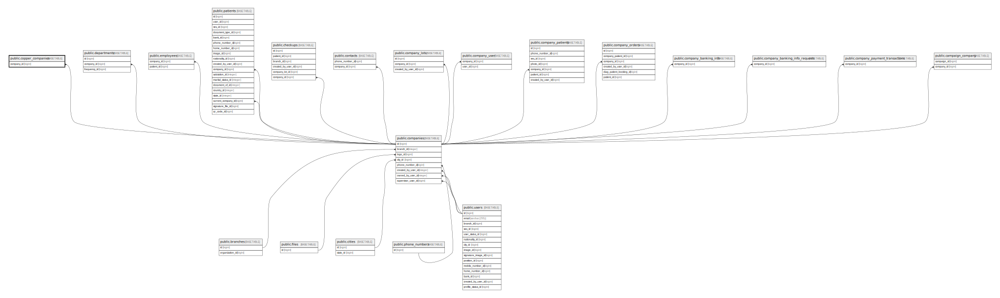

# public.copper_companies

## Description

## Columns

| Name                       | Type                           | Default                                      | Nullable | Parents                                 |
| -------------------------- | ------------------------------ | -------------------------------------------- | -------- | --------------------------------------- |
| id                         | bigint                         | nextval('copper_companies_id_seq'::regclass) | false    |                                         |
| created_at                 | timestamp(0) without time zone |                                              | true     |                                         |
| updated_at                 | timestamp(0) without time zone |                                              | true     |                                         |
| company_id                 | bigint                         |                                              | false    | [public.companies](public.companies.md) |
| copper_id                  | bigint                         |                                              | true     |                                         |
| copper_new_account_code    | bigint                         |                                              | true     |                                         |
| copper_customer_segment_id | integer                        |                                              | true     |                                         |

## Constraints

| Name                                | Type        | Definition                                                          |
| ----------------------------------- | ----------- | ------------------------------------------------------------------- |
| copper_companies_company_id_foreign | FOREIGN KEY | FOREIGN KEY (company_id) REFERENCES companies(id) ON DELETE CASCADE |
| copper_companies_pkey               | PRIMARY KEY | PRIMARY KEY (id)                                                    |

## Indexes

| Name                                              | Definition                                                                                                                         |
| ------------------------------------------------- | ---------------------------------------------------------------------------------------------------------------------------------- |
| copper_companies_pkey                             | CREATE UNIQUE INDEX copper_companies_pkey ON public.copper_companies USING btree (id)                                              |
| copper_companies_company_id_index                 | CREATE INDEX copper_companies_company_id_index ON public.copper_companies USING btree (company_id)                                 |
| copper_companies_copper_id_index                  | CREATE INDEX copper_companies_copper_id_index ON public.copper_companies USING btree (copper_id)                                   |
| copper_companies_copper_customer_segment_id_index | CREATE INDEX copper_companies_copper_customer_segment_id_index ON public.copper_companies USING btree (copper_customer_segment_id) |

## Relations

---

> Generated by [tbls](https://github.com/k1LoW/tbls)
