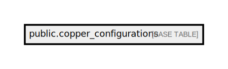

# public.copper_configurations

## Description

## Columns

| Name       | Type                           | Default                                           | Nullable |
| ---------- | ------------------------------ | ------------------------------------------------- | -------- |
| id         | bigint                         | nextval('copper_configurations_id_seq'::regclass) | false    |
| copper_id  | bigint                         |                                                   | false    |
| data       | json                           |                                                   | true     |
| created_at | timestamp(0) without time zone |                                                   | true     |
| updated_at | timestamp(0) without time zone |                                                   | true     |

## Constraints

| Name                       | Type        | Definition       |
| -------------------------- | ----------- | ---------------- |
| copper_configurations_pkey | PRIMARY KEY | PRIMARY KEY (id) |

## Indexes

| Name                       | Definition                                                                                      |
| -------------------------- | ----------------------------------------------------------------------------------------------- |
| copper_configurations_pkey | CREATE UNIQUE INDEX copper_configurations_pkey ON public.copper_configurations USING btree (id) |

## Relations

---

> Generated by [tbls](https://github.com/k1LoW/tbls)
