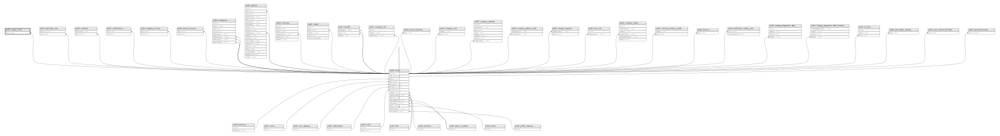

# public.copper_users

## Description

## Columns

| Name                            | Type                           | Default                                  | Nullable | Parents                         |
| ------------------------------- | ------------------------------ | ---------------------------------------- | -------- | ------------------------------- |
| id                              | bigint                         | nextval('copper_users_id_seq'::regclass) | false    |                                 |
| created_at                      | timestamp(0) without time zone |                                          | true     |                                 |
| updated_at                      | timestamp(0) without time zone |                                          | true     |                                 |
| user_id                         | bigint                         |                                          | false    | [public.users](public.users.md) |
| copper_id                       | bigint                         |                                          | true     |                                 |
| company_copper_id               | bigint                         |                                          | true     |                                 |
| company_copper_new_account_code | bigint                         |                                          | true     |                                 |
| title                           | varchar(255)                   |                                          | true     |                                 |
| is_registered                   | boolean                        | false                                    | false    |                                 |
| first_name                      | varchar(255)                   |                                          | true     |                                 |
| middle_name                     | varchar(255)                   |                                          | true     |                                 |
| family_name                     | varchar(255)                   |                                          | true     |                                 |
| email                           | varchar(255)                   |                                          | true     |                                 |
| phone                           | varchar(255)                   |                                          | true     |                                 |
| job_title                       | varchar(255)                   |                                          | true     |                                 |
| phone_is_validated              | boolean                        | false                                    | false    |                                 |
| email_is_validated              | boolean                        | false                                    | false    |                                 |

## Constraints

| Name                         | Type        | Definition                                                   |
| ---------------------------- | ----------- | ------------------------------------------------------------ |
| copper_users_user_id_foreign | FOREIGN KEY | FOREIGN KEY (user_id) REFERENCES users(id) ON DELETE CASCADE |
| copper_users_pkey            | PRIMARY KEY | PRIMARY KEY (id)                                             |

## Indexes

| Name                                 | Definition                                                                                               |
| ------------------------------------ | -------------------------------------------------------------------------------------------------------- |
| copper_users_pkey                    | CREATE UNIQUE INDEX copper_users_pkey ON public.copper_users USING btree (id)                            |
| copper_users_user_id_index           | CREATE INDEX copper_users_user_id_index ON public.copper_users USING btree (user_id)                     |
| copper_users_company_copper_id_index | CREATE INDEX copper_users_company_copper_id_index ON public.copper_users USING btree (company_copper_id) |

## Relations

---

> Generated by [tbls](https://github.com/k1LoW/tbls)
