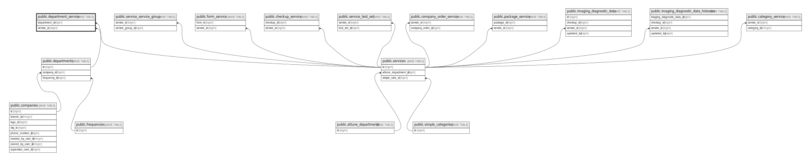

# public.department_service

## Description

## Columns

| Name          | Type                           | Default                                        | Nullable | Parents                                     |
| ------------- | ------------------------------ | ---------------------------------------------- | -------- | ------------------------------------------- |
| id            | bigint                         | nextval('department_service_id_seq'::regclass) | false    |                                             |
| department_id | bigint                         |                                                | false    | [public.departments](public.departments.md) |
| service_id    | bigint                         |                                                | false    | [public.services](public.services.md)       |
| created_at    | timestamp(0) without time zone |                                                | true     |                                             |
| updated_at    | timestamp(0) without time zone |                                                | true     |                                             |

## Constraints

| Name                                     | Type        | Definition                                                               |
| ---------------------------------------- | ----------- | ------------------------------------------------------------------------ |
| department_service_department_id_foreign | FOREIGN KEY | FOREIGN KEY (department_id) REFERENCES departments(id) ON DELETE CASCADE |
| department_service_service_id_foreign    | FOREIGN KEY | FOREIGN KEY (service_id) REFERENCES services(id) ON DELETE CASCADE       |
| department_service_pkey                  | PRIMARY KEY | PRIMARY KEY (id)                                                         |

## Indexes

| Name                    | Definition                                                                                |
| ----------------------- | ----------------------------------------------------------------------------------------- |
| department_service_pkey | CREATE UNIQUE INDEX department_service_pkey ON public.department_service USING btree (id) |

## Relations

---

> Generated by [tbls](https://github.com/k1LoW/tbls)
