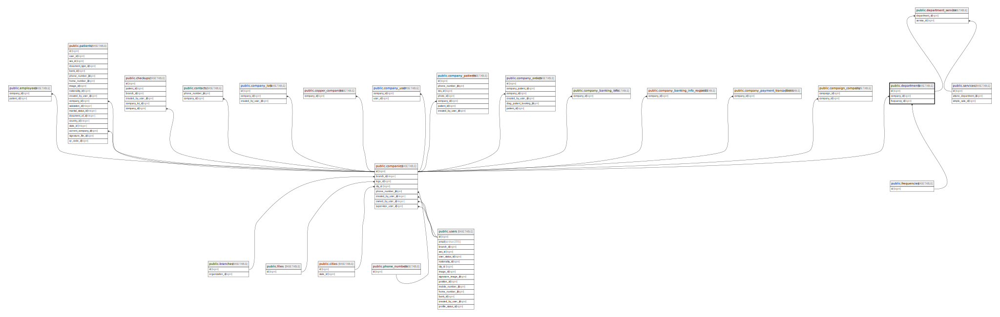

# public.departments

## Description

## Columns

| Name         | Type                           | Default                                 | Nullable | Children                                                  | Parents                                     |
| ------------ | ------------------------------ | --------------------------------------- | -------- | --------------------------------------------------------- | ------------------------------------------- |
| id           | bigint                         | nextval('departments_id_seq'::regclass) | false    | [public.department_service](public.department_service.md) |                                             |
| name         | varchar(255)                   |                                         | false    |                                                           |                                             |
| company_id   | bigint                         |                                         | false    |                                                           | [public.companies](public.companies.md)     |
| created_at   | timestamp(0) without time zone |                                         | true     |                                                           |                                             |
| updated_at   | timestamp(0) without time zone |                                         | true     |                                                           |                                             |
| frequency_id | bigint                         |                                         | true     |                                                           | [public.frequencies](public.frequencies.md) |

## Constraints

| Name                             | Type        | Definition                                                               |
| -------------------------------- | ----------- | ------------------------------------------------------------------------ |
| departments_company_id_foreign   | FOREIGN KEY | FOREIGN KEY (company_id) REFERENCES companies(id) ON DELETE CASCADE      |
| departments_pkey                 | PRIMARY KEY | PRIMARY KEY (id)                                                         |
| departments_frequency_id_foreign | FOREIGN KEY | FOREIGN KEY (frequency_id) REFERENCES frequencies(id) ON DELETE SET NULL |

## Indexes

| Name             | Definition                                                                  |
| ---------------- | --------------------------------------------------------------------------- |
| departments_pkey | CREATE UNIQUE INDEX departments_pkey ON public.departments USING btree (id) |

## Relations

---

> Generated by [tbls](https://github.com/k1LoW/tbls)
